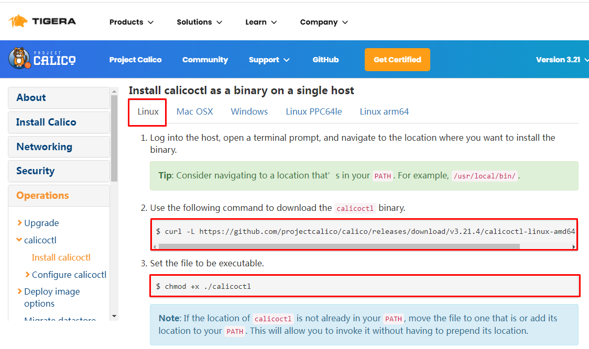

# kubeadm部署单Master节点kubernetes集群 1.30                                     

# 二、kubernetes 1.30 部署工具介绍

## What is Kubeadm ?

`Kubeadm is a tool built to provide best-practice "fast paths" for creating Kubernetes clusters. It performs the actions necessary to get a minimum viable, secure cluster up and running in a user friendly way. Kubeadm's scope is limited to the local node filesystem and the Kubernetes API, and it is intended to be a composable building block of higher level tools.`

Kubeadm是为创建Kubernetes集群提供最佳实践并能够“快速路径”构建kubernetes集群的工具。它能够帮助我们执行必要的操作，以获得最小可行的、安全的集群，并以用户友好的方式运行。


## Common Kubeadm cmdlets

1. **kubeadm init** to bootstrap the initial Kubernetes control-plane node. `初始化`
2. **kubeadm join** to bootstrap a Kubernetes worker node or an additional control plane node, and join it to the cluster. `添加工作节点到kubernetes集群`
3. **kubeadm upgrade** to upgrade a Kubernetes cluster to a newer version. ` 更新kubernetes版本`
4. **kubeadm reset** to revert any changes made to this host by kubeadm init or kubeadm join. ` 重置kubernetes集群`


# 三、kubernetes 1.30 部署环境准备

## 3.1 主机操作系统说明

| 序号 | 操作系统及版本 | 备注 |
| :--: | :------------: | :--: |
|  1   |  Ubuntu 24-04  |      |


## 3.2 主机硬件配置说明

| 需求 | CPU  | 内存 | 硬盘  | 角色         | 主机名   |
| ---- | ---- | ---- | ----- | ------------ | -------- |
| 值   | 2C   | 6G   | 120GB | master       | master01 |
| 值   | 2C   | 6G   | 120GB | worker(node) | worker01 |
| 值   | 2C   | 6G   | 120GB | worker(node) | worker02 |


## 3.3 主机配置

### 3.3.1 主机名配置

由于本次使用3台主机完成kubernetes集群部署，其中1台为master节点,名称为master01;其中2台为worker节点，名称分别为：worker01及worker02

~~~powershell
master节点,名称为master1
# hostnamectl set-hostname master01
~~~


~~~powershell
worker1节点,名称为worker1
# hostnamectl set-hostname worker01
~~~


~~~powershell
worker2节点,名称为worker2
# hostnamectl set-hostname worker02
~~~


### 3.3.2 主机IP地址配置

使用dhcp

### 3.3.3 主机名与IP地址解析


> 所有集群主机均需要进行配置。


~~~powershell
# cat /etc/hosts
127.0.0.1   localhost localhost.localdomain localhost4 localhost4.localdomain4
::1         localhost localhost.localdomain localhost6 localhost6.localdomain6
192.168.229.166 master01
192.168.229.168 worker01
192.168.229.169 worker02
~~~


### 3.3.4 防火墙配置


> 所有主机均需要操作。


~~~powershell
关闭现有防火墙ufw

systemctl disable ufw
systemctl stop ufw

ufw status
Status: inactive
~~~


### 3.3.5 SELINUX配置


> 所有主机均需要操作。修改SELinux配置需要重启操作系统。


~~~powershell
apt install selinux-utils

setenforce 0

getenforce
~~~


### 3.3.6 时间同步配置


>所有主机均需要操作。最小化安装系统需要安装ntpdate软件。


~~~powershell
apt install ntpsec-ntpdate

# crontab -l

crontab -e

0 */1 * * * /usr/sbin/ntpdate time1.aliyun.com
~~~


### 3.3.7 升级操作系统内核

> 已经够高

~~~powershell
root@worker02:~# uname -r
6.8.0-31-generic
~~~


### 3.3.8 配置内核转发及网桥过滤

>所有主机均需要操作。


~~~powershell
添加网桥过滤及内核转发配置文件
# cat /etc/sysctl.d/k8s.conf
net.bridge.bridge-nf-call-ip6tables = 1
net.bridge.bridge-nf-call-iptables = 1
net.ipv4.ip_forward = 1
vm.swappiness = 0
~~~


~~~powershell
加载br_netfilter模块
# modprobe br_netfilter
~~~


~~~powershell
查看是否加载
# lsmod | grep br_netfilter
br_netfilter           22256  0
bridge                151336  1 br_netfilter
~~~


~~~powershell
加载网桥过滤及内核转发配置文件
# sysctl -p /etc/sysctl.d/k8s.conf
net.bridge.bridge-nf-call-ip6tables = 1
net.bridge.bridge-nf-call-iptables = 1
net.ipv4.ip_forward = 1
vm.swappiness = 0
~~~


### 3.3.9 安装ipset及ipvsadm

> 所有主机均需要操作。主要用于实现service转发。


~~~powershell
安装ipset及ipvsadm
# apt -y install ipset ipvsadm
~~~


~~~powershell
配置ipvsadm模块加载方式
添加需要加载的模块
cat >> /etc/modules <<EOF
br_netfilter
ip_vs
ip_vs_rr
ip_vs_wrr
ip_vs_sh
EOF


update-initramfs -u

reboot
~~~


### 3.3.10 关闭SWAP分区

> 修改完成后需要重启操作系统，如不重启，可临时关闭，命令为swapoff -a


~~~powershell
永远关闭swap分区，需要重启操作系统
# cat /etc/fstab
......

# /swap.img                    swap    defaults        0 0

在上一行中行首添加#
~~~


## 3.4 Containerd部署

命令：

```
apt  install curl


curl -fsSL https://download.docker.com/linux/ubuntu/gpg | sudo apt-key add -
sudo add-apt-repository "deb [arch=amd64] https://download.docker.com/linux/ubuntu $(lsb_release -cs) stable"
apt install  containerd.io 

containerd config default > /etc/containerd/config.toml
```


# 四、kubernetes 1.30  集群部署

## 4.1 集群软件及版本说明

|          | kubeadm                | kubelet                                       | kubectl                |
| -------- | ---------------------- | --------------------------------------------- | ---------------------- |
| 版本     | 1.30.0                 | 1.30.0                                        | 1.30.0                 |
| 安装位置 | 集群所有主机           | 集群所有主机                                  | 集群所有主机           |
| 作用     | 初始化集群、管理集群等 | 用于接收api-server指令，对pod生命周期进行管理 | 集群应用命令行管理工具 |


## 4.2 kubernetes YUM源准备

yum源最新版本是1.28.2，我们要装的是1.30.0，采用二进制方式安装

```
sudo apt-get install -y apt-transport-https ca-certificates curl
curl https://mirrors.aliyun.com/kubernetes/apt/doc/apt-key.gpg | sudo apt-key add -
cat <<EOF | sudo tee /etc/apt/sources.list.d/kubernetes.list
deb https://mirrors.aliyun.com/kubernetes/apt/ kubernetes-xenial main
EOF
sudo apt update

```


二进制安装

```
chmod +x kubelet kubeadm kubectl
cp kubelet kubeadm kubectl /usr/bin/
```


```
cat  > /usr/lib/systemd/system/kubelet.service << EOF
[Unit]
Description=kubelet: The Kubernetes Node Agent
Documentation=https://kubernetes.io/docs/home/
Wants=network-online.target
After=network-online.target

[Service]
ExecStart=/usr/bin/kubelet
Restart=always
StartLimitInterval=0
RestartSec=10

[Install]
WantedBy=multi-user.target

EOF
```


## 4.3 集群软件安装


~~~powershell
apt install -y kubelet kubeadm kubectl
apt-mark hold kubelet kubeadm kubectl


apt remove  kubelet kubeadm kubectl
 apt-mark unhold kubelet kubeadm kubectl
 
 systemctl unmask kubelet
~~~


## 4.4 配置kubelet

>为了实现docker使用的cgroupdriver与kubelet使用的cgroup的一致性，建议修改如下文件内容。


~~~powershell
# vim /etc/sysconfig/kubelet
KUBELET_EXTRA_ARGS="--cgroup-driver=systemd"
~~~


~~~powershell
设置kubelet为开机自启动即可，由于没有生成配置文件，集群初始化后自动启动
# systemctl enable kubelet
~~~


## 4.5 集群镜像准备

> 可使用VPN实现下载。或者放到阿里云上

~~~powershell
root@master01:~# kubeadm config images list --kubernetes-version=v1.30.0
registry.k8s.io/kube-apiserver:v1.30.0
registry.k8s.io/kube-controller-manager:v1.30.0
registry.k8s.io/kube-scheduler:v1.30.0
registry.k8s.io/kube-proxy:v1.30.0
registry.k8s.io/coredns/coredns:v1.11.1
registry.k8s.io/pause:3.9
registry.k8s.io/etcd:3.5.12-0
~~~


## 4.6 集群初始化

修改sandbox image

```
vi /etc/containerd/config.toml

    sandbox_image = "registry.cn-hangzhou.aliyuncs.com/hxpdocker/pause:3.9"
    
systemctl restart containerd
```


kubeadm-config.yaml

```
apiVersion: kubeadm.k8s.io/v1beta3
kind: ClusterConfiguration
kubernetesVersion: "1.30.0"  
imageRepository: registry.cn-hangzhou.aliyuncs.com/hxpdocker
networking:
  podSubnet: "10.244.0.0/16"  
  serviceSubnet: "10.68.0.0/16" 
apiServer:
  extraArgs:
    advertise-address: "192.168.229.166"  
```


~~~powershell
[root@master01 ~]# kubeadm init --config kubeadm-config.yaml 
~~~


~~~powershell
root@master01:~# kubeadm init --config kubeadm-config.yaml 
[init] Using Kubernetes version: v1.30.0
[preflight] Running pre-flight checks
[preflight] Pulling images required for setting up a Kubernetes cluster
[preflight] This might take a minute or two, depending on the speed of your internet connection
[preflight] You can also perform this action in beforehand using 'kubeadm config images pull'
[certs] Using certificateDir folder "/etc/kubernetes/pki"
[certs] Generating "ca" certificate and key
[certs] Generating "apiserver" certificate and key
[certs] apiserver serving cert is signed for DNS names [kubernetes kubernetes.default kubernetes.default.svc kubernetes.default.svc.cluster.local master01] and IPs [10.68.0.1 192.168.229.166]
[certs] Generating "apiserver-kubelet-client" certificate and key
[certs] Generating "front-proxy-ca" certificate and key
[certs] Generating "front-proxy-client" certificate and key
[certs] Generating "etcd/ca" certificate and key
[certs] Generating "etcd/server" certificate and key
[certs] etcd/server serving cert is signed for DNS names [localhost master01] and IPs [192.168.229.166 127.0.0.1 ::1]
[certs] Generating "etcd/peer" certificate and key
[certs] etcd/peer serving cert is signed for DNS names [localhost master01] and IPs [192.168.229.166 127.0.0.1 ::1]
[certs] Generating "etcd/healthcheck-client" certificate and key
[certs] Generating "apiserver-etcd-client" certificate and key
[certs] Generating "sa" key and public key
[kubeconfig] Using kubeconfig folder "/etc/kubernetes"
[kubeconfig] Writing "admin.conf" kubeconfig file
[kubeconfig] Writing "super-admin.conf" kubeconfig file
[kubeconfig] Writing "kubelet.conf" kubeconfig file
[kubeconfig] Writing "controller-manager.conf" kubeconfig file
[kubeconfig] Writing "scheduler.conf" kubeconfig file
[etcd] Creating static Pod manifest for local etcd in "/etc/kubernetes/manifests"
[control-plane] Using manifest folder "/etc/kubernetes/manifests"
[control-plane] Creating static Pod manifest for "kube-apiserver"
[control-plane] Creating static Pod manifest for "kube-controller-manager"
[control-plane] Creating static Pod manifest for "kube-scheduler"
[kubelet-start] Writing kubelet environment file with flags to file "/var/lib/kubelet/kubeadm-flags.env"
[kubelet-start] Writing kubelet configuration to file "/var/lib/kubelet/config.yaml"
[kubelet-start] Starting the kubelet
[wait-control-plane] Waiting for the kubelet to boot up the control plane as static Pods from directory "/etc/kubernetes/manifests"
[kubelet-check] Waiting for a healthy kubelet. This can take up to 4m0s
[kubelet-check] The kubelet is healthy after 501.219909ms
[api-check] Waiting for a healthy API server. This can take up to 4m0s
[api-check] The API server is healthy after 6.501842138s
[upload-config] Storing the configuration used in ConfigMap "kubeadm-config" in the "kube-system" Namespace
[kubelet] Creating a ConfigMap "kubelet-config" in namespace kube-system with the configuration for the kubelets in the cluster
[upload-certs] Skipping phase. Please see --upload-certs
[mark-control-plane] Marking the node master01 as control-plane by adding the labels: [node-role.kubernetes.io/control-plane node.kubernetes.io/exclude-from-external-load-balancers]
[mark-control-plane] Marking the node master01 as control-plane by adding the taints [node-role.kubernetes.io/control-plane:NoSchedule]
[bootstrap-token] Using token: 6052s4.7c8bq51xchgzmgky
[bootstrap-token] Configuring bootstrap tokens, cluster-info ConfigMap, RBAC Roles
[bootstrap-token] Configured RBAC rules to allow Node Bootstrap tokens to get nodes
[bootstrap-token] Configured RBAC rules to allow Node Bootstrap tokens to post CSRs in order for nodes to get long term certificate credentials
[bootstrap-token] Configured RBAC rules to allow the csrapprover controller automatically approve CSRs from a Node Bootstrap Token
[bootstrap-token] Configured RBAC rules to allow certificate rotation for all node client certificates in the cluster
[bootstrap-token] Creating the "cluster-info" ConfigMap in the "kube-public" namespace
[kubelet-finalize] Updating "/etc/kubernetes/kubelet.conf" to point to a rotatable kubelet client certificate and key
[addons] Applied essential addon: CoreDNS
[addons] Applied essential addon: kube-proxy

Your Kubernetes control-plane has initialized successfully!

To start using your cluster, you need to run the following as a regular user:

  mkdir -p $HOME/.kube
  sudo cp -i /etc/kubernetes/admin.conf $HOME/.kube/config
  sudo chown $(id -u):$(id -g) $HOME/.kube/config

Alternatively, if you are the root user, you can run:

  export KUBECONFIG=/etc/kubernetes/admin.conf

You should now deploy a pod network to the cluster.
Run "kubectl apply -f [podnetwork].yaml" with one of the options listed at:
  https://kubernetes.io/docs/concepts/cluster-administration/addons/

Then you can join any number of worker nodes by running the following on each as root:

kubeadm join 192.168.229.166:6443 --token 6052s4.7c8bq51xchgzmgky \
        --discovery-token-ca-cert-hash sha256:601e7d0ab41d02251bba3aa632acaadf967db7c76420fa31831ee66f26ea98de 
~~~


## 4.7 集群应用客户端管理集群文件准备

~~~powershell
[root@master1 ~]# mkdir -p $HOME/.kube
[root@master1 ~]# cp -i /etc/kubernetes/admin.conf $HOME/.kube/config
[root@master1 ~]# chown $(id -u):$(id -g) $HOME/.kube/config
[root@master1 ~]# ls /root/.kube/
config
~~~


~~~powershell
# export KUBECONFIG=/etc/kubernetes/admin.conf
~~~


## 4.8 集群网络准备

> 使用calico部署集群网络
>
> 安装参考网址：https://projectcalico.docs.tigera.io/about/about-calico


### 4.8.1 calico安装


~~~powershell
下载operator资源清单文件
# wget https://calico-v3-25.netlify.app/archive/v3.25/manifests/tigera-operator.yaml
~~~


~~~powershell
应用资源清单文件，创建operator
# kubectl create -f tigera-operator.yaml
~~~

删除删不掉的名称空间

```
kubectl get namespace tigera-operator -o json > devtesting.json
打开devtesting.json把finalizers里的内容删掉
kubectl proxy --port 8080
curl -k -H "Content-Type: application/json" -X PUT --data-binary @devtesting.json http://127.0.0.1:8080/api/v1/namespaces/tigera-operator/finalize
```


~~~powershell
通过自定义资源方式安装
# wget https://calico-v3-25.netlify.app/archive/v3.25/manifests/custom-resources.yaml
~~~


~~~powershell
修改文件第13行，修改为使用kubeadm init ----pod-network-cidr对应的IP地址段
# vim custom-resources.yaml
......
 11     ipPools:
 12     - blockSize: 26
 13       cidr: 10.244.0.0/16 
 14       encapsulation: VXLANCrossSubnet
......
~~~


~~~powershell
应用资源清单文件
# kubectl apply -f custom-resources.yaml -n tigera-operator
~~~


~~~powershell
监视calico-sysem命名空间中pod运行情况
# watch kubectl get pods -n calico-system
~~~

>Wait until each pod has the `STATUS` of `Running`.


~~~powershell
删除 master 上的 taint
# kubectl taint nodes --all node-role.kubernetes.io/master-
~~~


~~~powershell
已经全部运行
# kubectl get pods -n calico-system
NAME                                      READY   STATUS    RESTARTS   AGE
calico-kube-controllers-666bb9949-dzp68   1/1     Running   0          11m
calico-node-jhcf4                         1/1     Running   4          11m
calico-typha-68b96d8d9c-7qfq7             1/1     Running   2          11m
~~~


~~~powershell
查看kube-system命名空间中coredns状态，处于Running状态表明联网成功。
# kubectl get pods -n kube-system
NAME                               READY   STATUS    RESTARTS   AGE
coredns-558bd4d5db-4jbdv           1/1     Running   0          113m
coredns-558bd4d5db-pw5x5           1/1     Running   0          113m
etcd-master01                      1/1     Running   0          113m
kube-apiserver-master01            1/1     Running   0          113m
kube-controller-manager-master01   1/1     Running   4          113m
kube-proxy-kbx4z                   1/1     Running   0          113m
kube-scheduler-master01            1/1     Running   3          113m
~~~


### 4.8.2 calico客户端安装





~~~powershell
下载二进制文件
# curl -L https://github.com/projectcalico/calico/releases/download/v3.21.4/calicoctl-linux-amd64 -o calicoctl

~~~


~~~powershell
安装calicoctl
# mv calicoctl /usr/bin/

为calicoctl添加可执行权限
# chmod +x /usr/bin/calicoctl

查看添加权限后文件
# ls /usr/bin/calicoctl
/usr/bin/calicoctl

查看calicoctl版本
# calicoctl  version
Client Version:    v3.21.4
Git commit:        220d04c94
Cluster Version:   v3.21.4
Cluster Type:      typha,kdd,k8s,operator,bgp,kubeadm
~~~


~~~powershell
通过~/.kube/config连接kubernetes集群，查看已运行节点
# DATASTORE_TYPE=kubernetes KUBECONFIG=~/.kube/config calicoctl get nodes
NAME
master01
~~~


## 4.9 集群工作节点添加

> 因容器镜像下载较慢，可能会导致报错，主要错误为没有准备好cni（集群网络插件），如有网络，请耐心等待即可。


~~~powershell
[root@worker01 ]# kubeadm join 192.168.10.11:6443 --token 9kz5id.pp5rhvzahj51lb5q \
        --discovery-token-ca-cert-hash sha256:86f9c4471b6ef08090ecffadc798040fe5d8ef5975afe527e65d2f0aedf66493
~~~


~~~powershell
[root@worker02 ~]# kubeadm join 192.168.10.11:6443 --token 9kz5id.pp5rhvzahj51lb5q \
        --discovery-token-ca-cert-hash sha256:86f9c4471b6ef08090ecffadc798040fe5d8ef5975afe527e65d2f0aedf66493
~~~


~~~powershell
在master节点上操作，查看网络节点是否添加
# DATASTORE_TYPE=kubernetes KUBECONFIG=~/.kube/config calicoctl get nodes
NAME
master01
worker01
worker02
~~~


## 4.10 验证集群可用性

~~~powershell
查看所有的节点
[root@master01 ~]# kubectl get nodes
NAME       STATUS   ROLES                  AGE    VERSION
master01   Ready    control-plane,master   169m   v1.21.0
worker01   Ready    <none>                 28m    v1.21.0
worker02   Ready    <none>                 28m    v1.21.0
~~~


~~~powershell
查看集群健康情况,理想状态
[root@master01 ~]# kubectl get cs
NAME                 STATUS    MESSAGE             ERROR
controller-manager   Healthy   ok
scheduler            Healthy   ok
etcd-0               Healthy   {"health":"true"}
~~~


~~~powershell
真实情况
# kubectl get cs
Warning: v1 ComponentStatus is deprecated in v1.19+
NAME                 STATUS      MESSAGE                                                                                       ERROR
scheduler            Unhealthy   Get "http://127.0.0.1:10251/healthz": dial tcp 127.0.0.1:10251: connect: connection refused
controller-manager   Unhealthy   Get "http://127.0.0.1:10252/healthz": dial tcp 127.0.0.1:10252: connect: connection refused
etcd-0               Healthy     {"health":"true"}
~~~


~~~powershell
查看kubernetes集群pod运行情况
[root@master01 ~]# kubectl get pods -n kube-system
NAME                               READY   STATUS    RESTARTS   AGE
coredns-558bd4d5db-4jbdv           1/1     Running   1          169m
coredns-558bd4d5db-pw5x5           1/1     Running   1          169m
etcd-master01                      1/1     Running   1          170m
kube-apiserver-master01            1/1     Running   1          170m
kube-controller-manager-master01   1/1     Running   14         170m
kube-proxy-kbx4z                   1/1     Running   1          169m
kube-proxy-rgtr8                   1/1     Running   0          29m
kube-proxy-sq9xv                   1/1     Running   0          29m
kube-scheduler-master01            1/1     Running   11         170m
~~~


~~~powershell
再次查看calico-system命名空间中pod运行情况。
[root@master01 ~]# kubectl get pods -n calico-system
NAME                                      READY   STATUS    RESTARTS   AGE
calico-kube-controllers-666bb9949-dzp68   1/1     Running   3          70m
calico-node-jhcf4                         1/1     Running   15         70m
calico-node-jxq9p                         1/1     Running   0          30m
calico-node-kf78q                         1/1     Running   0          30m
calico-typha-68b96d8d9c-7qfq7             1/1     Running   13         70m
calico-typha-68b96d8d9c-wz2zj             1/1     Running   0          20m
~~~

