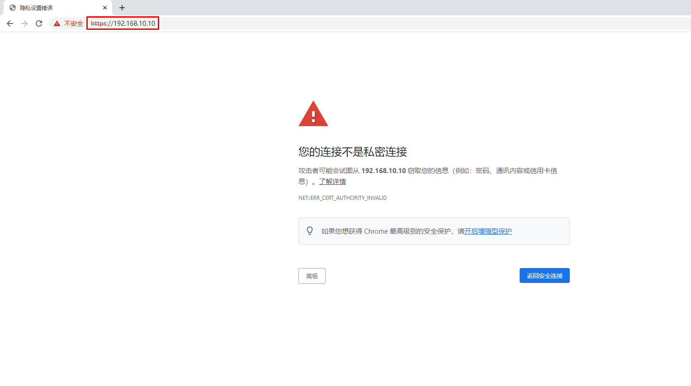
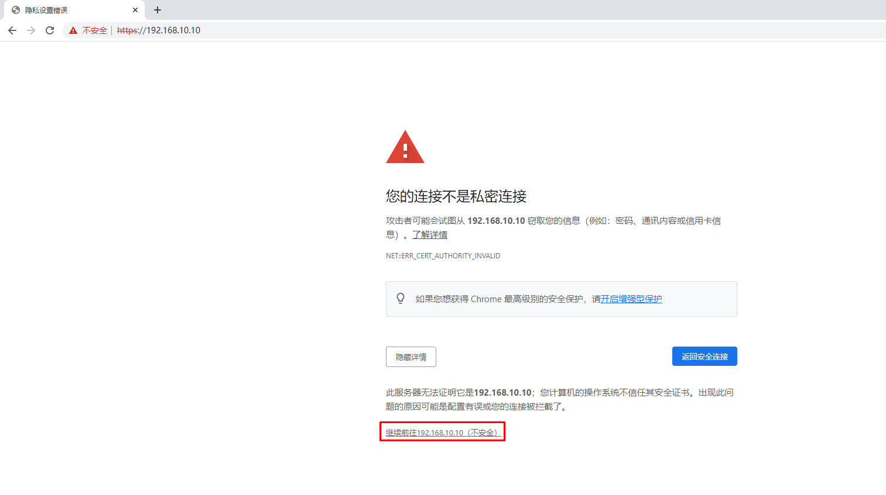

# 使用RKE构建企业生产级Kubernetes集群

# RKE工具介绍

## 这与 RKE 或 K3s 有什么不同？

RKE2 结合了 RKE1.x 版本（以下简称 RKE1）和 K3s 的优点和特性。

从 K3s 中，它继承了可用性、易操作性和部署模式。

从 RKE1 来看，它继承了与上游 Kubernetes 的紧密一致性。在一些地方，K3s 与上游的 Kubernetes 有分歧，以便为边缘部署进行优化，但 RKE1 和 RKE2 可以与上游保持密切一致。

重要的是，RKE2 不像 RKE1 那样依赖 Docker。RKE1 利用 Docker 来部署和管理控制平面组件以及 Kubernetes 的容器运行时间。RKE2 将控制平面组件作为静态 pod 启动，由 kubelet 管理。嵌入的容器运行时是 containerd。


# 集群主机准备

## 集群主机配置要求

### 部署集群环境说明

部署Kubernetes集群机器需要满足以下几个条件：

1）一台或多台机器，操作系统 CentOS7

2）硬件配置：2GB或更多RAM，2个CPU或更多CPU，硬盘100GB或更多

3） 集群中所有机器之间网络互通

4）可以访问外网，需要拉取镜像，如果服务器不能上网，需要提前下载镜像并导入节点

5）禁止swap分区


### 软件环境

| 软件       | 版本            |
| ---------- | --------------- |
| 操作系统   | centos-stream-9 |
| containerd | 1.7.16          |
| kubernetes | 1.28.0          |


### 集群主机名称、IP地址及角色规划


| 主机名称 | IP地址          | 角色                        |
| -------- | --------------- | --------------------------- |
| master01 | 192.168.229.170 | controlplane、rancher、rke2 |
| master02 | 192.168.229.171 | controlpane                 |
| master03 | 192.168.229.172 | controlpane                 |
| worker01 | 192.168.229.173 | worker                      |
| worker02 | 192.168.229.174 | worker                      |


## 集群主机名称配置

> 所有集群主机均要配置对应的主机名称即可。


~~~powershell
hostnamectl set-hostname master01

hostnamectl set-hostname master02

hostnamectl set-hostname master03

hostnamectl set-hostname worker01

hostnamectl set-hostname worker02

~~~


~~~powershell
把xxx替换为对应的主机名
192.168.229.170 master01
192.168.229.171 master02
192.168.229.172 master03
192.168.229.173 worker01
192.168.229.174 worker02
~~~


## 集群主机IP地址配置

> 所有集群主机均要配置对应的主机IP地址即可。

### 

vi /etc/NetworkManager/system-connections/ens33.nmconnection

~~~powershell
master01节点IP地址为：192.168.229.170/24

[ipv4]
address1=192.168.229.170/24,192.168.229.2
dns=114.114.114.114
method=manual

~~~

```
nmcli c reload                       
nmcli c up ens33                    
```


~~~powershell
master02节点IP地址为：192.168.229.171/24


[ipv4]
address1=192.168.229.171/24,192.168.229.2
dns=114.114.114.114
method=manual
~~~


~~~powershell
master03节点IP地址为：192.168.229.172/24

[ipv4]
address1=192.168.229.172/24,192.168.229.2
dns=114.114.114.114
method=manual
~~~


~~~powershell
worker01节点IP地址为：192.168.229.173/24

[ipv4]
address1=192.168.229.173/24,192.168.229.2
dns=114.114.114.114
method=manual
~~~


~~~powershell
worker02节点IP地址为：192.168.229.174/24

[ipv4]
address1=192.168.229.174/24,192.168.229.2
dns=114.114.114.114
method=manual
~~~


## 主机名与IP地址解析

> 所有主机均要配置。


~~~powershell
# vim /etc/hosts
# cat /etc/hosts
127.0.0.1   localhost localhost.localdomain localhost4 localhost4.localdomain4
::1         localhost localhost.localdomain localhost6 localhost6.localdomain6
192.168.229.170 master01
192.168.229.171 master02
192.168.229.172 worker01
192.168.229.173 worker02
192.168.229.174 etcd01
~~~


## 配置内核转发及网桥过滤

>所有主机均需要操作。


~~~powershell
# cat << EOF | tee /etc/modules-load.d/k8s.conf
overlay
br_netfilter
EOF
~~~


~~~powershell
# modprobe overlay
# modprobe br_netfilter
~~~


~~~powershell
# lsmod | egrep "overlay"
overlay               151552  0

# lsmod | egrep "br_netfilter"
br_netfilter           32768  0
bridge                307200  1 br_netfilter
~~~


~~~powershell
添加网桥过滤及内核转发配置文件
# cat << EOF| tee /etc/sysctl.d/k8s.conf
net.bridge.bridge-nf-call-ip6tables = 1
net.bridge.bridge-nf-call-iptables = 1
net.ipv4.ip_forward = 1
EOF
~~~


~~~powershell
加载内核参数
# sysctl --system
~~~


## 主机安全设置

> 所有主机均要设置

### 防火墙


~~~powershell
systemctl stop firewalld
systemctl disable firewalld
firewall-cmd --state
~~~


### selinux

> 修改完成后一定要重启操作系统


~~~powershell
永久关闭，一定要重启操作系统后生效。
sed -ri 's/SELINUX=enforcing/SELINUX=disabled/' /etc/selinux/config
~~~


~~~powershell
临时关闭，不重启操作系统，即刻生效。
# setenforce 0 
~~~


## 主机swap分区设置

> 所有主机均要配置


~~~powershell
永久关闭，需要重启操作系统生效。
# sed -ri 's/.*swap.*/#&/' /etc/fstab
~~~


~~~powershell
# cat /etc/fstab

......
#/dev/mapper/centos_192-swap swap                    swap    defaults        0 0
~~~


~~~powershell
临时关闭，不需要重启操作系统，即刻生效。
# swapoff -a
~~~


## 时间同步

>所有主机均需要操作。最小化安装系统需要安装chronyd软件。


~~~powershell
#启用chronyd服务
systemctl enable chronyd

#重启chronyd服务
systemctl restart chronyd

#查看chronyd服务状态
systemctl status chronyd

~~~

```
vi /etc/chrony.conf

pool ntp1.aliyun.com iburst
pool ntp2.aliyun.com iburst
pool ntp3.aliyun.com iburst
pool ntp4.aliyun.com iburst
pool ntp5.aliyun.com iburst
pool ntp6.aliyun.com iburst

systemctl restart chronyd
```


## ipset及ipvsadm

> 所有主机均需要操作。


~~~powershell
安装ipset及ipvsadm
# yum -y install ipset ipvsadm
~~~


~~~powershell
配置ipvsadm模块加载
添加需要加载的模块
# cat << EOF | tee /etc/modules-load.d/ipvs.conf
ip_vs
ip_vs_rr
ip_vs_wrr
ip_vs_sh
nf_conntrack
EOF
~~~


~~~powershell
# cat << EOF | tee ipvs.sh
#!/bin/sh
modprobe -- ip_vs
modprobe -- ip_vs_rr
modprobe -- ip_vs_wrr
modprobe -- ip_vs_sh
modprobe -- nf_conntrack
EOF
~~~


~~~powershell
# sh ipvs.sh
~~~


# 安装rke2

## 安装master01

```
mkdir -p /etc/rancher/rke2/
```

/etc/rancher/rke2/config.yaml

```
token: demo-server
node-name: master01
tls-san: 192.168.229.170
system-default-registry: "registry.cn-hangzhou.aliyuncs.com"
kube-proxy-arg:
  - proxy-mode=ipvs
  - ipvs-strict-arp=true
```

```
解释说明：
token参数表示自定义一个token标识
node-name表示配置节点名，该名称是全局唯一的，用于dns路由
tls-san表示TLS证书上添加额外的主机名或IPv4/IPv6地址作为备用名称，此处填写本机IP，该参数是为了避免固定注册地址的证书错误
system-default-registry表示使用国内镜像
```


```
curl -sfL https://rancher-mirror.oss-cn-beijing.aliyuncs.com/rke2/install.sh | INSTALL_RKE2_MIRROR=cn sh -
```

```
 systemctl enable rke2-server.service && systemctl start rke2-server.service
```

```
cat <<EOF>> /etc/profile.d/rke2.sh
export PATH=$PATH:/var/lib/rancher/rke2/bin
EOF
source /etc/profile

```

```
mkdir /root/.kube
cp /etc/rancher/rke2/rke2.yaml /root/.kube/config
```

```
[root@master01 ~]# kubectl get pod -A
NAMESPACE     NAME                                                    READY   STATUS      RESTARTS   AGE
kube-system   cloud-controller-manager-master01                       1/1     Running     0          3m3s
kube-system   etcd-master01                                           1/1     Running     0          2m51s
kube-system   helm-install-rke2-canal-cjh8h                           0/1     Completed   0          3m10s
kube-system   helm-install-rke2-coredns-rcqwm                         0/1     Completed   0          3m10s
kube-system   helm-install-rke2-ingress-nginx-7bt88                   0/1     Completed   0          3m10s
kube-system   helm-install-rke2-metrics-server-r88tv                  0/1     Completed   0          3m10s
kube-system   helm-install-rke2-snapshot-controller-crd-zlmln         0/1     Completed   0          3m10s
kube-system   helm-install-rke2-snapshot-controller-hxghz             0/1     Completed   0          3m10s
kube-system   helm-install-rke2-snapshot-validation-webhook-sck2v     0/1     Completed   0          3m10s
kube-system   kube-apiserver-master01                                 1/1     Running     0          2m39s
kube-system   kube-controller-manager-master01                        1/1     Running     0          3m5s
kube-system   kube-proxy-master01                                     1/1     Running     0          3m7s
kube-system   kube-scheduler-master01                                 1/1     Running     0          3m5s
kube-system   rke2-canal-g9ctm                                        2/2     Running     0          2m33s
kube-system   rke2-coredns-rke2-coredns-559cfcb9c4-854dq              1/1     Running     0          2m36s
kube-system   rke2-coredns-rke2-coredns-autoscaler-7f68c9cd4b-h72b6   1/1     Running     0          2m36s
kube-system   rke2-ingress-nginx-controller-xxxgs                     1/1     Running     0          2m13s
kube-system   rke2-metrics-server-7cdd8cf4b8-6clbk                    1/1     Running     0          2m34s
kube-system   rke2-snapshot-controller-6965b95ffc-7qqvf               1/1     Running     0          2m33s
kube-system   rke2-snapshot-validation-webhook-5fd4d57cdb-gdl9r       1/1     Running     0          2m32s
[root@master01 ~]# 
```

## 安装master02

```
[root@master01 ~]# cat /var/lib/rancher/rke2/server/node-token 
K104c1a9d5c3de538f9e9eefccf1d7c193541697a07179727666ccb4f2dd5e985de::server:demo-server
```


```
mkdir -p /etc/rancher/rke2/
```


```
vim /etc/rancher/rke2/config.yaml

server: https://192.168.229.170:9345
token: demo-server
node-name: master02
system-default-registry: "registry.cn-hangzhou.aliyuncs.com"
tls-san: 192.168.229.171
kube-proxy-arg:
  - proxy-mode=ipvs
  - ipvs-strict-arp=true
```


```
curl -sfL https://rancher-mirror.oss-cn-beijing.aliyuncs.com/rke2/install.sh | INSTALL_RKE2_MIRROR=cn sh -


systemctl enable rke2-server.service && systemctl start rke2-server.service
```

```
cat <<EOF>> /etc/profile.d/rke2.sh
export PATH=$PATH:/var/lib/rancher/rke2/bin
EOF
source /etc/profile
```

```
mkdir /root/.kube
cp /etc/rancher/rke2/rke2.yaml /root/.kube/config
```


## 安装master03


```
mkdir -p /etc/rancher/rke2/
```


```
vim /etc/rancher/rke2/config.yaml

server: https://192.168.229.170:9345
token: demo-server
node-name: master03
system-default-registry: "registry.cn-hangzhou.aliyuncs.com"
tls-san: 192.168.229.172
kube-proxy-arg:
  - proxy-mode=ipvs
  - ipvs-strict-arp=true
```


```
curl -sfL https://rancher-mirror.oss-cn-beijing.aliyuncs.com/rke2/install.sh | INSTALL_RKE2_MIRROR=cn sh -


systemctl enable rke2-server.service && systemctl start rke2-server.service
```

```
cat <<EOF>> /etc/profile.d/rke2.sh
export PATH=$PATH:/var/lib/rancher/rke2/bin
EOF
source /etc/profile
```

```
mkdir /root/.kube
cp /etc/rancher/rke2/rke2.yaml /root/.kube/config
```


## 安装work01

```
mkdir -p /etc/rancher/rke2/
```


```
vim /etc/rancher/rke2/config.yaml

server: https://192.168.229.170:9345
node-name: k8s-worker01
token: demo-server
system-default-registry: "registry.cn-hangzhou.aliyuncs.com"
kube-proxy-arg:
  - proxy-mode=ipvs
  - ipvs-strict-arp=true
```


```
curl -sfL https://rancher-mirror.oss-cn-beijing.aliyuncs.com/rke2/install.sh | INSTALL_RKE2_MIRROR=cn INSTALL_RKE2_TYPE="agent"  sh -


systemctl enable rke2-agent.service && systemctl start rke2-agent.service

```

```
cat <<EOF>> /etc/profile.d/rke2.sh
export PATH=$PATH:/var/lib/rancher/rke2/bin
EOF
source /etc/profile

mkdir /root/.kube
cp /etc/rancher/rke2/rke2.yaml /root/.kube/config
```


## 安装worker02

## 

```
mkdir -p /etc/rancher/rke2/
```


```
vim /etc/rancher/rke2/config.yaml

server: https://192.168.229.170:9345
node-name: k8s-worker02
token: demo-server
system-default-registry: "registry.cn-hangzhou.aliyuncs.com"
kube-proxy-arg:
  - proxy-mode=ipvs
  - ipvs-strict-arp=true
```


```
curl -sfL https://rancher-mirror.oss-cn-beijing.aliyuncs.com/rke2/install.sh | INSTALL_RKE2_MIRROR=cn INSTALL_RKE2_TYPE="agent"  sh -


systemctl enable rke2-agent.service && systemctl start rke2-agent.service

```

```
cat <<EOF>> /etc/profile.d/rke2.sh
export PATH=$PATH:/var/lib/rancher/rke2/bin
EOF
source /etc/profile

mkdir /root/.kube
cp /etc/rancher/rke2/rke2.yaml /root/.kube/config
```


# 集群web管理 rancher

> 在master01运行

rancher控制面板主要方便用于控制k8s集群，查看集群状态，编辑集群等。

## 安装 Rancher Helm Char

Rancher 是使用 Kubernetes 的 [Helm](https://helm.sh/) 包管理器安装的。Helm Chart 为 Kubernetes YAML 清单文件提供了模板语法。通过 Helm，用户可以创建可配置的 deployment，而不仅仅只能使用静态文件。

如果系统无法直接访问互联网，请参见[离线环境：Kubernetes 安装](https://ranchermanager.docs.rancher.com/zh/getting-started/installation-and-upgrade/other-installation-methods/air-gapped-helm-cli-install/install-rancher-ha)。

如果要指定安装的 Rancher 版本，请参见[选择 Rancher 版本](https://ranchermanager.docs.rancher.com/zh/getting-started/installation-and-upgrade/resources/choose-a-rancher-version)。

如果要指定用于安装 Rancher 的 Helm 版本，请参见[Helm 版本要求](https://ranchermanager.docs.rancher.com/zh/getting-started/installation-and-upgrade/resources/helm-version-requirements)。

备注

本安装指南假定你使用的是 Helm 3。

要设置 Rancher：

1. [添加 Helm Chart 仓库](https://ranchermanager.docs.rancher.com/zh/getting-started/installation-and-upgrade/install-upgrade-on-a-kubernetes-cluster#1-添加-helm-chart-仓库)
2. [为 Rancher 创建命名空间](https://ranchermanager.docs.rancher.com/zh/getting-started/installation-and-upgrade/install-upgrade-on-a-kubernetes-cluster#2-为-rancher-创建命名空间)
3. [选择 SSL 配置](https://ranchermanager.docs.rancher.com/zh/getting-started/installation-and-upgrade/install-upgrade-on-a-kubernetes-cluster#3-选择-ssl-配置)
4. [安装 cert-manager](https://ranchermanager.docs.rancher.com/zh/getting-started/installation-and-upgrade/install-upgrade-on-a-kubernetes-cluster#4-安装-cert-manager)（除非你自带证书，否则 TLS 将在负载均衡器上终止）
5. [使用 Helm 和你选择的证书选项安装 Rancher](https://ranchermanager.docs.rancher.com/zh/getting-started/installation-and-upgrade/install-upgrade-on-a-kubernetes-cluster#5-根据你选择的证书选项通过-helm-安装-rancher)
6. [验证 Rancher Server 是否部署成功](https://ranchermanager.docs.rancher.com/zh/getting-started/installation-and-upgrade/install-upgrade-on-a-kubernetes-cluster#6-验证-rancher-server-是否部署成功)
7. [保存选项](https://ranchermanager.docs.rancher.com/zh/getting-started/installation-and-upgrade/install-upgrade-on-a-kubernetes-cluster#7-保存选项)

### 1. 添加 Helm Chart 仓库

执行 `helm repo add` 命令，以添加包含安装 Rancher 的 Chart 的 Helm Chart 仓库。有关如何选择仓库，以及哪个仓库最适合你的用例，请参见[选择 Rancher 版本](https://ranchermanager.docs.rancher.com/zh/getting-started/getting-started/installation-and-upgrade/resources/choose-a-rancher-version.md)。

- Latest：建议用于试用最新功能

  ```text
  helm repo add rancher-latest https://releases.rancher.com/server-charts/latest
  ```

  

- Stable：建议用于生产环境

  ```text
  helm repo add rancher-stable https://releases.rancher.com/server-charts/stable
  ```

  

- Alpha：即将发布的实验性预览。

  ```text
  helm repo add rancher-alpha https://releases.rancher.com/server-charts/alpha
  ```

  

  注意：不支持升级到 Alpha 版、从 Alpha 版升级或在 Alpha 版之间升级。

### 2. 为 Rancher 创建命名空间

你需要定义一个 Kubernetes 命名空间，用于安装由 Chart 创建的资源。这个命名空间的名称为 `cattle-system`：

```text
kubectl create namespace cattle-system
```


### 3. 选择 SSL 配置

Rancher Management Server 默认需要 SSL/TLS 配置来保证访问的安全性。

备注

如果你想在外部终止 SSL/TLS，请参见[外部负载均衡器的 TLS 终止](https://ranchermanager.docs.rancher.com/zh/getting-started/getting-started/installation-and-upgrade/installation-references/helm-chart-options.md#外部-tls-终止)。

你可以从以下三种证书来源中选择一种，用于在 Rancher Server 中终止 TLS：

- **Rancher 生成的 TLS 证书**：要求你在集群中安装 `cert-manager`。Rancher 使用 `cert-manager` 签发并维护证书。Rancher 会生成自己的 CA 证书，并使用该 CA 签署证书。然后 `cert-manager`负责管理该证书。
- **Let's Encrypt**：Let's Encrypt 选项也需要使用 `cert-manager`。但是，在这种情况下，cert-manager 与 Let's Encrypt 的特殊颁发者相结合，该颁发者执行获取 Let's Encrypt 颁发的证书所需的所有操作（包括请求和验证）。此配置使用 HTTP 验证（`HTTP-01`），因此负载均衡器必须具有可以从互联网访问的公共 DNS 记录。
- **你已有的证书**：使用已有的 CA 颁发的公有或私有证书。Rancher 将使用该证书来保护 WebSocket 和 HTTPS 流量。在这种情况下，你必须上传名称分别为 `tls.crt` 和 `tls.key`的 PEM 格式的证书以及相关的密钥。如果你使用私有 CA，则还必须上传该 CA 证书。这是由于你的节点可能不信任此私有 CA。Rancher 将获取该 CA 证书，并从中生成一个校验和，各种 Rancher 组件将使用该校验和来验证其与 Rancher 的连接。

| 配置                       | Helm Chart 选项                  | 是否需要 cert-manager                                        |
| -------------------------- | -------------------------------- | ------------------------------------------------------------ |
| Rancher 生成的证书（默认） | `ingress.tls.source=rancher`     | [是](https://ranchermanager.docs.rancher.com/zh/getting-started/installation-and-upgrade/install-upgrade-on-a-kubernetes-cluster#4-安装-cert-manager) |
| Let’s Encrypt              | `ingress.tls.source=letsEncrypt` | [是](https://ranchermanager.docs.rancher.com/zh/getting-started/installation-and-upgrade/install-upgrade-on-a-kubernetes-cluster#4-安装-cert-manager) |
| 你已有的证书               | `ingress.tls.source=secret`      | 否                                                           |

### 4. 安装 cert-manager

> 如果你使用自己的证书文件（`ingress.tls.source=secret`）或使用[外部负载均衡器的 TLS 终止](https://ranchermanager.docs.rancher.com/zh/getting-started/installation-and-upgrade/installation-references/helm-chart-options#外部-tls-终止)，你可以跳过此步骤。

仅在使用 Rancher 生成的证书（`ingress.tls.source=rancher`）或 Let's Encrypt 颁发的证书（`ingress.tls.source=letsEncrypt`）时，才需要安装 cert-manager。

<details id="cert-manager" class="details_lb9f isBrowser_bmU9 alert alert--info details_b_Ee" data-collapsed="true" style="box-sizing: border-box; --tw-border-spacing-x: 0; --tw-border-spacing-y: 0; --tw-translate-x: 0; --tw-translate-y: 0; --tw-rotate: 0; --tw-skew-x: 0; --tw-skew-y: 0; --tw-scale-x: 1; --tw-scale-y: 1; --tw-pan-x: ; --tw-pan-y: ; --tw-pinch-zoom: ; --tw-scroll-snap-strictness: proximity; --tw-gradient-from-position: ; --tw-gradient-via-position: ; --tw-gradient-to-position: ; --tw-ordinal: ; --tw-slashed-zero: ; --tw-numeric-figure: ; --tw-numeric-spacing: ; --tw-numeric-fraction: ; --tw-ring-inset: ; --tw-ring-offset-width: 0px; --tw-ring-offset-color: #fff; --tw-ring-color: rgb(59 130 246 / 0.5); --tw-ring-offset-shadow: 0 0 #0000; --tw-ring-shadow: 0 0 #0000; --tw-shadow: 0 0 #0000; --tw-shadow-colored: 0 0 #0000; --tw-blur: ; --tw-brightness: ; --tw-contrast: ; --tw-grayscale: ; --tw-hue-rotate: ; --tw-invert: ; --tw-saturate: ; --tw-sepia: ; --tw-drop-shadow: ; --tw-backdrop-blur: ; --tw-backdrop-brightness: ; --tw-backdrop-contrast: ; --tw-backdrop-grayscale: ; --tw-backdrop-hue-rotate: ; --tw-backdrop-invert: ; --tw-backdrop-opacity: ; --tw-backdrop-saturate: ; --tw-backdrop-sepia: ; --ifm-alert-background-color: var(
        --ifm-color-info-contrast-background
      ); --ifm-alert-background-color-highlight: rgba(84, 199, 236, 0.15); --ifm-alert-foreground-color: var(
        --ifm-color-info-contrast-foreground
      ); --ifm-alert-border-color: var(--ifm-color-info-dark); --ifm-code-background: var(--ifm-alert-background-color-highlight); --ifm-link-color: var(--ifm-alert-foreground-color); --ifm-link-hover-color: var(--ifm-alert-foreground-color); --ifm-link-decoration: underline; --ifm-tabs-color: var(--ifm-alert-foreground-color); --ifm-tabs-color-active: var(--ifm-alert-foreground-color); --ifm-tabs-color-active-border: var(--ifm-alert-border-color); background-color: var(--ifm-alert-background-color); border: 1px solid var(--ifm-alert-border-color); border-radius: var(--ifm-alert-border-radius); box-shadow: var(--ifm-alert-shadow); color: var(--ifm-alert-foreground-color); padding: var(--ifm-alert-padding-vertical) var(--ifm-alert-padding-horizontal); --docusaurus-details-summary-arrow-size: 0.38rem; --docusaurus-details-transition: transform var(--ifm-transition-fast) ease; --docusaurus-details-decoration-color: var(--ifm-alert-border-color); margin: 0 0 var(--ifm-spacing-vertical); font-family: Lato, sans-serif; font-size: 16px; font-style: normal; font-variant-ligatures: normal; font-variant-caps: normal; font-weight: 400; letter-spacing: normal; orphans: 2; text-align: start; text-indent: 0px; text-transform: none; widows: 2; word-spacing: 0px; -webkit-text-stroke-width: 0px; white-space: normal; text-decoration-thickness: initial; text-decoration-style: initial; text-decoration-color: initial;"><summary style="box-sizing: border-box; --tw-border-spacing-x: 0; --tw-border-spacing-y: 0; --tw-translate-x: 0; --tw-translate-y: 0; --tw-rotate: 0; --tw-skew-x: 0; --tw-skew-y: 0; --tw-scale-x: 1; --tw-scale-y: 1; --tw-pan-x: ; --tw-pan-y: ; --tw-pinch-zoom: ; --tw-scroll-snap-strictness: proximity; --tw-gradient-from-position: ; --tw-gradient-via-position: ; --tw-gradient-to-position: ; --tw-ordinal: ; --tw-slashed-zero: ; --tw-numeric-figure: ; --tw-numeric-spacing: ; --tw-numeric-fraction: ; --tw-ring-inset: ; --tw-ring-offset-width: 0px; --tw-ring-offset-color: #fff; --tw-ring-color: rgb(59 130 246 / 0.5); --tw-ring-offset-shadow: 0 0 #0000; --tw-ring-shadow: 0 0 #0000; --tw-shadow: 0 0 #0000; --tw-shadow-colored: 0 0 #0000; --tw-blur: ; --tw-brightness: ; --tw-contrast: ; --tw-grayscale: ; --tw-hue-rotate: ; --tw-invert: ; --tw-saturate: ; --tw-sepia: ; --tw-drop-shadow: ; --tw-backdrop-blur: ; --tw-backdrop-brightness: ; --tw-backdrop-contrast: ; --tw-backdrop-grayscale: ; --tw-backdrop-hue-rotate: ; --tw-backdrop-invert: ; --tw-backdrop-opacity: ; --tw-backdrop-saturate: ; --tw-backdrop-sepia: ; position: relative; cursor: pointer; list-style: none; padding-left: 1rem;">单击展开</summary></details>

### 5. 根据你选择的证书选项，通过 Helm 安装 Rancher

不同的证书配置需要使用不同的 Rancher 安装命令。

但是，无论证书如何配置，Rancher 在 `cattle-system` 命名空间中的安装名称应该总是 `rancher`。

测试和开发：

这个安装 Rancher 的最终命令需要一个将流量转发到 Rancher 的域名。如果你使用 Helm CLI 设置概念证明，则可以在传入 `hostname` 选项时使用伪域名。伪域名的一个例子是 `<IP_OF_LINUX_NODE>.sslip.io`，这会把 Rancher 暴露在它运行的 IP 上。生产安装中要求填写真实的域名。

- Rancher 生成的证书
- Let's Encrypt
- 证书文件

默认情况是使用 Rancher 生成 CA，并使用 `cert-manager` 颁发用于访问 Rancher Server 接口的证书。

由于 `rancher` 是 `ingress.tls.source` 的默认选项，因此在执行 `helm install` 命令时，我们不需要指定 `ingress.tls.source`。

- 将 `hostname` 设置为解析到你的负载均衡器的 DNS 名称。
- 将 `bootstrapPassword` 设置为 `admin` 用户独有的值。
- 如果你需要安装指定的 Rancher 版本，使用 `--version` 标志，例如 `--version 2.7.0`。
- 对于 Kubernetes v1.25 或更高版本，使用 Rancher v2.7.2-v2.7.4 时，将 `global.cattle.psp.enabled` 设置为 `false`。对于 Rancher v2.7.5 及更高版本来说，这不是必需的，但你仍然可以手动设置该选项。

```text
helm install rancher rancher-stable/rancher \
  --namespace cattle-system  --create-namespace \
  --set hostname=rancher.my.org \
  --set bootstrapPassword=admin
```

```
[root@master01 rancher]# helm install rancher . --namespace cattle-system  --create-namespace 
NAME: rancher
LAST DEPLOYED: Wed May 22 11:10:16 2024
NAMESPACE: cattle-system
STATUS: deployed
REVISION: 1
TEST SUITE: None
NOTES:
Rancher Server has been installed.

NOTE: Rancher may take several minutes to fully initialize. Please standby while Certificates are being issued, Containers are started and the Ingress rule comes up.

Check out our docs at https://rancher.com/docs/

If you provided your own bootstrap password during installation, browse to https://rancher.my.org to get started.

If this is the first time you installed Rancher, get started by running this command and clicking the URL it generates:

​```
echo https://rancher.my.org/dashboard/?setup=$(kubectl get secret --namespace cattle-system bootstrap-secret -o go-template='{{.data.bootstrapPassword|base64decode}}')
​```

To get just the bootstrap password on its own, run:

​```
kubectl get secret --namespace cattle-system bootstrap-secret -o go-template='{{.data.bootstrapPassword|base64decode}}{{ "\n" }}'
​```


Happy Containering!
```


如果你安装的是 alpha 版本，Helm 会要求你在安装命令中添加 `--devel` 选项：

```text
helm install rancher rancher-alpha/rancher --devel
```


等待 Rancher 运行：

```text
kubectl -n cattle-system rollout status deploy/rancher
Waiting for deployment "rancher" rollout to finish: 0 of 3 updated replicas are available...
deployment "rancher" successfully rolled out
```


Rancher Chart 有许多选项，用于为你的具体环境自定义安装。以下是一些常见的高级方案：

- [HTTP 代理](https://ranchermanager.docs.rancher.com/zh/getting-started/installation-and-upgrade/installation-references/helm-chart-options#http-代理)
- [私有容器镜像仓库](https://ranchermanager.docs.rancher.com/zh/getting-started/installation-and-upgrade/installation-references/helm-chart-options#私有仓库和离线安装)
- [外部负载均衡器上的 TLS 终止](https://ranchermanager.docs.rancher.com/zh/getting-started/installation-and-upgrade/installation-references/helm-chart-options#外部-tls-终止)

如需获取完整的选项列表，请参见 [Chart 选项](https://ranchermanager.docs.rancher.com/zh/getting-started/installation-and-upgrade/installation-references/helm-chart-options)。

### 6. 验证 Rancher Server 是否部署成功

添加密文后，检查 Rancher 是否已成功运行：

```text
kubectl -n cattle-system rollout status deploy/rancher
Waiting for deployment "rancher" rollout to finish: 0 of 3 updated replicas are available...
deployment "rancher" successfully rolled out
```


如果你看到 `error: deployment "rancher" exceeded its progress deadline` 这个错误，可运行以下命令来检查 deployment 的状态：

```text
kubectl -n cattle-system get deploy rancher
NAME      DESIRED   CURRENT   UP-TO-DATE   AVAILABLE   AGE
rancher   3         3         3            3           3m
```


`DESIRED` 和 `AVAILABLE`的个数应该相同。

### 7. 保存选项

请保存你使用的 `--set` 选项。使用 Helm 升级 Rancher 到新版本时，你将需要使用相同的选项。

### 安装完成

安装已完成。现在 Rancher Server 应该已经可以正常运行了。

使用浏览器打开把流量转发到你的负载均衡器的 DNS 域名。然后，你就会看到一个漂亮的登录页面了。

如果遇到任何问题，请参见[故障排除](https://ranchermanager.docs.rancher.com/zh/getting-started/installation-and-upgrade/install-upgrade-on-a-kubernetes-cluster/troubleshooting)。


```
openssl genrsa -out rancher.key 2048

openssl req -new -x509 -key rancher.key -out rancher.crt -subj /C=CN/ST=Beijing/L=Biejing/O=DevOpes/CN=rancher.my.org

kubectl create secret tls tls-rancher-ingress  --cert=rancher.crt --key=rancher.key -n cattle-system


```


## 访问rancher








## 在rancher web界面添加kubernetes集群


```
curl --insecure -fL https://192.168.229.170:31815/system-agent-install.sh | sudo  sh -s - --server https://192.168.229.170:31815 --label 'cattle.io/os=linux' --token 4jnkdnnjnwwgnflz2msp22hb7xct65xhh2ctwv4r7tzk9mhndkk2vm --etcd --controlplane --worker
```


# 部署应用

## 创建资源清单文件

~~~powershell
# vim nginx.yaml
# cat nginx.yaml
---
apiVersion: apps/v1
kind: Deployment
metadata:
  name: nginx-test
spec:
  selector:
    matchLabels:
      app: nginx
      env: test
      owner: rancher
  replicas: 2 # tells deployment to run 2 pods matching the template
  template:
    metadata:
      labels:
        app: nginx
        env: test
        owner: rancher
    spec:
      containers:
        - name: nginx-test
          image: nginx:1.19.9
          ports:
            - containerPort: 80
~~~


~~~powershell
# c
~~~


~~~powershell
# vim nginx-service.yaml
# cat nginx-service.yaml
---
apiVersion: v1
kind: Service
metadata:
  name: nginx-test
  labels:
    run: nginx
spec:
  type: NodePort
  ports:
  - port: 80
    protocol: TCP
  selector:
    owner: rancher
~~~


~~~powershell
# kubectl apply -f nginx-service.yaml
~~~


## 验证


~~~powershell
# kubectl get pods -o wide
NAME                          READY   STATUS    RESTARTS   AGE   IP           NODE            NOMINATED NODE   READINESS GATES
nginx-test-7d95fb4447-6k4p9   1/1     Running   0          55s   10.42.2.11   192.168.10.12   <none>           <none>
nginx-test-7d95fb4447-sfnsk   1/1     Running   0          55s   10.42.2.10   192.168.10.12   <none>           <none>
~~~


~~~powershell
# kubectl get svc -o wide
NAME         TYPE        CLUSTER-IP      EXTERNAL-IP   PORT(S)        AGE     SELECTOR
kubernetes   ClusterIP   10.43.0.1       <none>        443/TCP        120m    <none>
nginx-test   NodePort    10.43.158.143   <none>        80:32669/TCP   2m22s   owner=rancher
~~~


# 通过RKE2卸载K8S集群


~~~powershell
# rke2-uninstall.sh
~~~

或

~~~powershell
# which rke2-uninstall.sh
/usr/local/bin/rke2-uninstall.sh


# /usr/local/bin/rke2-uninstall.sh
~~~


