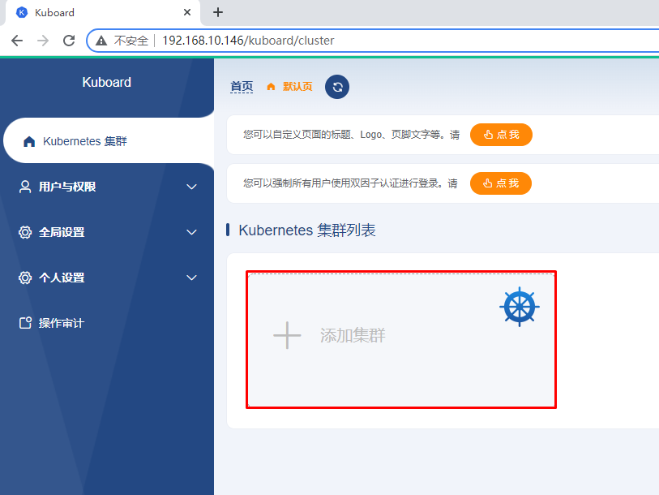

# 使用sealos部署kubernetes集群并实现集群管理

> 本次使用6台主机完成，其中3台主机为master节点，3台主机为worker节点。

# 一、主机准备

## 1.1 配置主机名

~~~powershell
# hostnamectl set-hostname xxx

hostnamectl set-hostname k8s-master01
hostnamectl set-hostname k8s-master02
hostnamectl set-hostname k8s-master03
hostnamectl set-hostname k8s-worker01
hostnamectl set-hostname k8s-worker02
hostnamectl set-hostname k8s-worker03
~~~


## 1.2 设置静态IP地址

| 序号 | 主机名       | 主机IP          |
| ---- | ------------ | --------------- |
| 1    | k8s-master01 | 192.168.229.170 |
| 2    | k8s-master02 | 192.168.229.171 |
| 3    | k8s-master03 | 192.168.229.172 |
| 4    | k8s-worker01 | 192.168.229.173 |
| 5    | k8s-worker02 | 192.168.229.174 |
| 6    | k8s-worker03 | 192.168.229.175 |

vi /etc/NetworkManager/system-connections/ens33.nmconnection

~~~powershell
k8s-master01节点IP地址为：192.168.229.170/24

[ipv4]
address1=192.168.229.170/24,192.168.229.2
dns=114.114.114.114
method=manual

~~~

```
nmcli c reload                       
nmcli c up ens33                    
```


~~~powershell
k8s-master02节点IP地址为：192.168.229.171/24


[ipv4]
address1=192.168.229.171/24,192.168.229.2
dns=114.114.114.114
method=manual
~~~


~~~powershell
k8s-master03节点IP地址为：192.168.229.172/24

[ipv4]
address1=192.168.229.172/24,192.168.229.2
dns=114.114.114.114
method=manual
~~~


~~~powershell
k8s-worker01节点IP地址为：192.168.229.173/24

[ipv4]
address1=192.168.229.173/24,192.168.229.2
dns=114.114.114.114
method=manual
~~~


~~~powershell
k8s-worker02节点IP地址为：192.168.229.174/24

[ipv4]
address1=192.168.229.174/24,192.168.229.2
dns=114.114.114.114
method=manual
~~~


~~~powershell
k8s-worker03节点IP地址为：192.168.229.175/24

[ipv4]
address1=192.168.229.175/24,192.168.229.2
dns=114.114.114.114
method=manual
~~~


## 1.3 配置主机名与IP地址解析

> 下面解析是管理员添加，sealos在运行过程中，也会自动添加主机名与IP地址解析关系。


~~~powershell
# /etc/hosts
cat >>/etc/hosts <<EOF
192.168.229.170 k8s-master01
192.168.229.171 k8s-master02
192.168.229.172 k8s-master03
192.168.229.173 k8s-worker01
192.168.229.174 k8s-worker02
192.168.229.175 k8s-worker03
EOF
~~~


## 1.4 升级内核

不需要升级，够高

~~~powershell
rpm --import https://www.elrepo.org/RPM-GPG-KEY-elrepo.org

yum -y install https://www.elrepo.org/elrepo-release-7.0-4.el7.elrepo.noarch.rpm

yum --enablerepo="elrepo-kernel" -y install kernel-lt.x86_64

awk -F \' '$1=="menuentry " {print i++ " : " $2}' /etc/grub2.cfg

grub2-set-default "CentOS Linux (5.4.204-1.el7.elrepo.x86_64) 7 (Core)"

reboot
~~~


# 二、sealos准备


~~~powershell
wget -c https://github.com/labring/sealos/releases/download/v4.3.7-rc1/sealos_4.3.7-rc1_linux_amd64.tar.gz

tar zvxf sealos_4.3.7-rc1_linux_amd64.tar.gz

chmod +x sealos
mv sealos /usr/local/bin/
~~~


~~~powershell
[root@k8s-master01 ~]# sealos version
SealosVersion:
  buildDate: "2023-10-22T13:02:15Z"
  compiler: gc
  gitCommit: fef14bea
  gitVersion: 4.3.7-rc1
  goVersion: go1.20.10
  platform: linux/amd64
~~~


```
tar zvxf helm-v3.11.1-linux-amd64.tar.gz 
chmod +x linux-amd64/helm
mv linux-amd64/helm /usr/local/bin/
```


# 三、使用sealos部署kubernetes集群

> kubernetes集群默认使用containerd

```
sealos-config.yaml

kubeadmConfig:
  imageRepository: registry.aliyuncs.com/google_containers

```


~~~powershell
export SEALOS_PAUSE_IMAGE=registry.aliyuncs.com/google_containers/pause:3.9

sealos run registry.cn-hangzhou.aliyuncs.com/hxpdocker/kubernetes:v1.29.0 registry.cn-hangzhou.aliyuncs.com/hxpdocker/calico:v3.26.1     --masters 192.168.229.170,192.168.229.171,192.168.229.172     --nodes 192.168.229.173,192.168.229.174,192.168.229.175 --config-file  sealos-config.yaml   --passwd mark  
~~~


~~~powershell
# kubectl get nodes
NAME           STATUS   ROLES           AGE   VERSION
k8s-master01   Ready    control-plane   16h   v1.24.0
k8s-master02   Ready    control-plane   16h   v1.24.0
k8s-master03   Ready    control-plane   16h   v1.24.0
k8s-worker01   Ready    <none>          16h   v1.24.0
~~~


~~~powershell
# kubectl get pods -n kube-system
NAME                                   READY   STATUS    RESTARTS      AGE
coredns-6d4b75cb6d-59ph5               1/1     Running   1 (15h ago)   16h
coredns-6d4b75cb6d-wz6tx               1/1     Running   1 (15h ago)   16h
etcd-k8s-master01                      1/1     Running   1 (15h ago)   16h
etcd-k8s-master02                      1/1     Running   1 (15h ago)   16h
etcd-k8s-master03                      1/1     Running   1 (15h ago)   16h
kube-apiserver-k8s-master01            1/1     Running   3 (15h ago)   16h
kube-apiserver-k8s-master02            1/1     Running   1 (15h ago)   16h
kube-apiserver-k8s-master03            1/1     Running   1 (15h ago)   16h
kube-controller-manager-k8s-master01   1/1     Running   3 (15h ago)   16h
kube-controller-manager-k8s-master02   1/1     Running   1 (15h ago)   16h
kube-controller-manager-k8s-master03   1/1     Running   1 (15h ago)   16h
kube-proxy-5l26r                       1/1     Running   1 (15h ago)   16h
kube-proxy-cfbkh                       1/1     Running   1 (15h ago)   16h
kube-proxy-g92fs                       1/1     Running   1 (15h ago)   16h
kube-proxy-zsjxv                       1/1     Running   1 (15h ago)   16h
kube-scheduler-k8s-master01            1/1     Running   3 (15h ago)   16h
kube-scheduler-k8s-master02            1/1     Running   1 (15h ago)   16h
kube-scheduler-k8s-master03            1/1     Running   1 (15h ago)   16h
kube-sealyun-lvscare-k8s-worker01      1/1     Running   1 (15h ago)   16h
~~~


添加节点

```
sealos add --nodes 192.168.229.174
sealos add --nodes 192.168.229.175
```


# 四、使用kuboard实现k8s集群托管

| 序号 | 主机名         | 主机IP         |
| ---- | -------------- | -------------- |
| 1    | kuboard-server | 192.168.10.146 |


## 4.1 kuboard部署及访问


```
kubectl label node k8s-worker01 k8s.kuboard.cn/role=etcd
kubectl label node k8s-worker02 k8s.kuboard.cn/role=etcd
kubectl label node k8s-worker03 k8s.kuboard.cn/role=etcd
```


```
kubectl apply -f https://addons.kuboard.cn/kuboard/kuboard-v3.yaml
```


> 用户名和密码分别为：admin及Kuboard123


## 4.2 kuboard添加k8s集群





