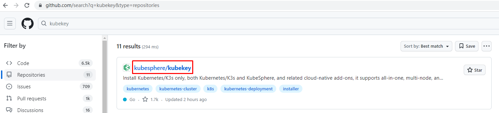
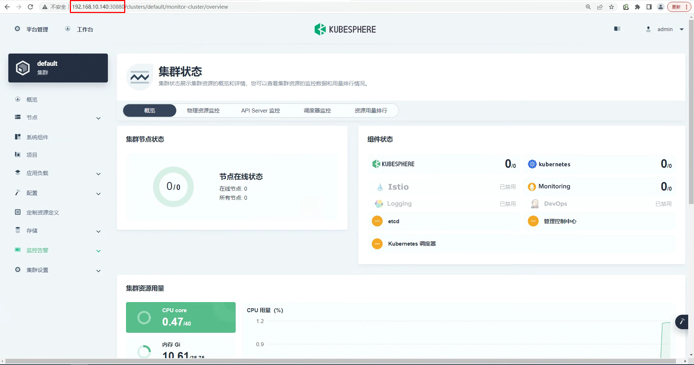

# kubesphere 3.4.0 抢鲜版部署

# 一、使用kubekey 3.1.1 部署K8S 1.29.0高可用集群


## 1.1 主机准备

| 主机名       | IP地址             | 备注   |
| ------------ | ------------------ | ------ |
| k8s-master01 | 192.168.229.170/24 | master |
| k8s-master02 | 192.168.229.171/24 | master |
| k8s-master03 | 192.168.220.172/24 | master |
| k8s-worker01 | 192.168.229.173/24 | worker |
| k8s-worker02 | 192.168.229.174/24 | worker |


### 主机IP地址配置

vi /etc/NetworkManager/system-connections/ens33.nmconnection

~~~powershell
k8s-master01节点IP地址为：192.168.229.170/24

[ipv4]
address1=192.168.229.170/24,192.168.229.2
dns=114.114.114.114
method=manual

~~~

```
nmcli c reload                       
nmcli c up ens33                    
```


~~~powershell
k8s-master02节点IP地址为：192.168.229.171/24


[ipv4]
address1=192.168.229.171/24,192.168.229.2
dns=114.114.114.114
method=manual
~~~


~~~powershell
k8s-master03节点IP地址为：192.168.229.172/24

[ipv4]
address1=192.168.229.172/24,192.168.229.2
dns=114.114.114.114
method=manual
~~~


~~~powershell
k8s-worker01节点IP地址为：192.168.229.173/24

[ipv4]
address1=192.168.229.173/24,192.168.229.2
dns=114.114.114.114
method=manual
~~~


~~~powershell
k8s-worker02节点IP地址为：192.168.229.174/24

[ipv4]
address1=192.168.229.174/24,192.168.229.2
dns=114.114.114.114
method=manual
~~~

### 主机名设置

~~~powershell
hostnamectl set-hostname k8s-master01

hostnamectl set-hostname k8s-master02

hostnamectl set-hostname k8s-master03

hostnamectl set-hostname k8s-worker01

hostnamectl set-hostname k8s-worker02
~~~


### 设置主机名解析

~~~powershell
# vim /etc/hosts
# cat /etc/hosts
127.0.0.1   localhost localhost.localdomain localhost4 localhost4.localdomain4
::1         localhost localhost.localdomain localhost6 localhost6.localdomain6

cat >> /etc/hosts <<EOF
192.168.229.170 k8s-master01
192.168.229.171 k8s-master02
192.168.229.172 k8s-master03
192.168.229.173 k8s-worker01
192.168.229.174 k8s-worker02
EOF
~~~


## 1.2 软件准备

> kubernetes版本大于等于1.18,所有节点均需要安装

| 软件名称  | 是否安装         |
| --------- | ---------------- |
| socat     | 必须安装         |
| conntrack | 必须安装         |
| ebtables  | 可选，但推荐安装 |
| ipset     | 可选，但推荐安装 |
| ipvsadm   | 可选，但推荐安装 |


~~~powershell
# yum -y install socat conntrack ebtables ipset ipvsadm
~~~


## 1.3 使用Kubekey部署高可用K8S集群


### 1.3.1 Kubekey工具下载




~~~powershell
[root@k8s-master01 ~]# curl -sfL https://get-kk.kubesphere.io | sh -
~~~


~~~powershell
[root@k8s-master01 ~]# ls
kk kubekey-v3.1.1-linux-amd64.tar.gz
~~~


~~~powershell
[root@k8s-master01 ~]# mv kk /usr/local/bin/
~~~


### 1.3.2 高可用K8S集群部署

> 参考网址：https://www.kubesphere.io/zh/docs/v3.3/installing-on-linux/introduction/multioverview/
>
> 参考网址：https://github.com/kubesphere/kubekey


#### 1.3.2.1 创建kk部署K8S集群配置文件


~~~powershell
[root@k8s-master01 ~]# kk create config -f k8s-ha.yaml

输出内容如下：
Generate KubeKey config file successfully
~~~


~~~powershell
[root@k8s-master01 ~]# ls
k8s-ha.yaml
~~~


~~~powershell
[root@k8s-master01 ~]# vim k8s-ha.yaml
[root@k8s-master01 ~]# cat k8s-ha.yaml
cat >k8s-ha.yaml << "EOF"
apiVersion: kubekey.kubesphere.io/v1alpha2
kind: Cluster
metadata:
  name: cluster1
spec:
  hosts:
  - {name: k8s-master01, address: 192.168.229.170, internalAddress: 192.168.229.170, user: root, password: "mark"}
  - {name: k8s-master02, address: 192.168.229.171, internalAddress: 192.168.229.171, user: root, password: "mark"}
  - {name: k8s-master03, address: 192.168.229.172, internalAddress: 192.168.229.172, user: root, password: "mark"}
  - {name: k8s-worker01, address: 192.168.229.173, internalAddress: 192.168.229.173, user: root, password: "mark"}
  - {name: k8s-worker02, address: 192.168.229.174, internalAddress: 192.168.229.174, user: root, password: "mark"}
  roleGroups:
    etcd:
    - k8s-master01
    - k8s-master02
    - k8s-master03
    control-plane:
    - k8s-master01
    - k8s-master02
    - k8s-master03
    worker:
    - k8s-worker01
    - k8s-worker02
  controlPlaneEndpoint:
    ## Internal loadbalancer for apiservers
    internalLoadbalancer: haproxy

    domain: lb.kubemsb.com
    address: ""
    port: 6443
  kubernetes:
    version: v1.29.0
    clusterName: cluster.local
    autoRenewCerts: true
    containerManager: containerd
  etcd:
    type: kubekey
  network:
    plugin: calico
    kubePodsCIDR: 10.244.0.0/16
    kubeServiceCIDR: 10.96.0.0/16
    ## multus support. https://github.com/k8snetworkplumbingwg/multus-cni
    multusCNI:
      enabled: false
  registry:
    privateRegistry: ""
    namespaceOverride: ""
    registryMirrors: []
    insecureRegistries: []
  addons: []
EOF
~~~


> 关于认证方式，也可参考如下：
>
> 默认为root用户
>
> hosts:
>
>   - {name: master, address: 192.168.229.170, internalAddress: 192.168.229.170, password: mark}
>
> 使用ssh密钥实现免密登录
>
> hosts:
>
>   - {name: master, address: 192.168.229.170, internalAddress: 192.168.229.170, privateKeyPath: "~/.ssh/id_rsa"}


#### 1.3.2.2 执行kk创建k8s集群


~~~powershell
export KKZONE=cn

kk create cluster -f k8s-ha.yaml
~~~


~~~powershell
执行安装结束后：
18:28:03 CST Pipeline[CreateClusterPipeline] execute successfully
Installation is complete.

Please check the result using the command:

        kubectl get pod -A
        
        
查看节点
[root@k8s-master01 ~]# kubectl get nodes
NAME           STATUS   ROLES           AGE     VERSION
k8s-master01   Ready    control-plane   3m5s    v1.26.5
k8s-master02   Ready    control-plane   2m38s   v1.26.5
k8s-master03   Ready    control-plane   2m38s   v1.26.5
k8s-worker01   Ready    worker          2m22s   v1.26.5
k8s-worker02   Ready    worker          2m22s   v1.26.5

查看所有的Pod
[root@k8s-master01 ~]# kubectl get pods -A
NAMESPACE     NAME                                      READY   STATUS    RESTARTS      AGE
kube-system   calico-kube-controllers-8f69c78db-jbdbw   1/1     Running   1 (87s ago)   105s
kube-system   calico-node-9xl97                         1/1     Running   0             105s
kube-system   calico-node-gkxgw                         1/1     Running   0             105s
kube-system   calico-node-rbpp5                         1/1     Running   0             105s
kube-system   calico-node-tj4qk                         1/1     Running   0             105s
kube-system   calico-node-vv8nv                         1/1     Running   0             105s
kube-system   coredns-7f647946c8-5dt8g                  1/1     Running   0             2m17s
kube-system   coredns-7f647946c8-f4l4m                  1/1     Running   0             2m17s
kube-system   haproxy-k8s-worker01                      1/1     Running   0             101s
kube-system   haproxy-k8s-worker02                      1/1     Running   0             105s
kube-system   kube-apiserver-k8s-master01               1/1     Running   0             2m31s
kube-system   kube-apiserver-k8s-master02               1/1     Running   0             2m6s
kube-system   kube-apiserver-k8s-master03               1/1     Running   0             2m5s
kube-system   kube-controller-manager-k8s-master01      1/1     Running   0             2m31s
kube-system   kube-controller-manager-k8s-master02      1/1     Running   0             2m6s
kube-system   kube-controller-manager-k8s-master03      1/1     Running   0             2m6s
kube-system   kube-proxy-7fldd                          1/1     Running   0             107s
kube-system   kube-proxy-j8m4s                          1/1     Running   0             107s
kube-system   kube-proxy-lk25b                          1/1     Running   0             107s
kube-system   kube-proxy-xq8s5                          1/1     Running   0             107s
kube-system   kube-proxy-z6tt8                          1/1     Running   0             107s
kube-system   kube-scheduler-k8s-master01               1/1     Running   0             2m31s
kube-system   kube-scheduler-k8s-master02               1/1     Running   0             2m6s
kube-system   kube-scheduler-k8s-master03               1/1     Running   0             2m6s
kube-system   nodelocaldns-2lpkh                        1/1     Running   0             2m7s
kube-system   nodelocaldns-4v64k                        1/1     Running   0             111s
kube-system   nodelocaldns-dwdct                        1/1     Running   0             2m7s
kube-system   nodelocaldns-m9mng                        1/1     Running   0             111s
kube-system   nodelocaldns-vqvjp                        1/1     Running   0             2m17s
~~~


## 卸载

```
kk delete cluster --all -f k8s-ha.yaml
```


# 二、使用kubekey 3.1.1部署K8S 1.29.0高可用集群同时部署kubesphere 3.4.0

> 参考：一、使用kubekey 3.1.1 部署K8S 1.30.9高可用集群中方法准备kubekey


## 2.1 kk生成集群部署配置文件


~~~powershell
[root@k8s-master01 ~]# kk create config --with-kubernetes 1.30.0 --with-kubesphere v3.4.0 -f k8s-ha-kubesphere.yaml

输出内容如下：
Generate KubeKey config file successfully
~~~


~~~powershell
[root@k8s-master01 ~]# vim k8s-ha-kubesphere.yaml
[root@k8s-master01 ~]# cat  k8s-ha-kubesphere.yaml
cat > k8s-ha-kubesphere.yaml <<EOF
apiVersion: kubekey.kubesphere.io/v1alpha2
kind: Cluster
metadata:
  name: cluster1
spec:
  hosts:
  - {name: k8s-master01, address: 192.168.229.170, internalAddress: 192.168.229.170, user: root, password: "mark"}
  - {name: k8s-master02, address: 192.168.229.171, internalAddress: 192.168.229.171, user: root, password: "mark"}
  - {name: k8s-master03, address: 192.168.229.172, internalAddress: 192.168.229.172, user: root, password: "mark"}
  - {name: k8s-worker01, address: 192.168.229.173, internalAddress: 192.168.229.173, user: root, password: "mark"}
  - {name: k8s-worker02, address: 192.168.229.174, internalAddress: 192.168.229.174, user: root, password: "mark"}
  roleGroups:
    etcd:
    - k8s-master01
    - k8s-master02
    - k8s-master03
    control-plane:
    - k8s-master01
    - k8s-master02
    - k8s-master03
    worker:
    - k8s-worker01
    - k8s-worker02
  controlPlaneEndpoint:
    ## Internal loadbalancer for apiservers
    internalLoadbalancer: haproxy

    domain: lb.kubemsb.com
    address: ""
    port: 6443
  kubernetes:
    version: v1.29.0
    clusterName: cluster.local
    autoRenewCerts: true
    containerManager: containerd
  etcd:
    type: kubekey
  network:
    plugin: calico
    kubePodsCIDR: 10.244.0.0/16
    kubeServiceCIDR: 10.96.0.0/16
    ## multus support. https://github.com/k8snetworkplumbingwg/multus-cni
    multusCNI:
      enabled: false
  registry:
    privateRegistry: ""
    namespaceOverride: ""
    registryMirrors: []
    insecureRegistries: []
  addons: []


---
apiVersion: installer.kubesphere.io/v1alpha1
kind: ClusterConfiguration
metadata:
  name: ks-installer
  namespace: kubesphere-system
  labels:
    version: v3.4.0
spec:
  persistence:
    storageClass: ""
  authentication:
    jwtSecret: ""
  zone: ""
  local_registry: ""
  namespace_override: ""
  # dev_tag: ""
  etcd:
    monitoring: false
    endpointIps: localhost
    port: 2379
    tlsEnable: true
  common:
    core:
      console:
        enableMultiLogin: true
        port: 30880
        type: NodePort
    # apiserver:
    #  resources: {}
    # controllerManager:
    #  resources: {}
    redis:
      enabled: false
      enableHA: false
      volumeSize: 2Gi
    openldap:
      enabled: false
      volumeSize: 2Gi
    minio:
      volumeSize: 20Gi
    monitoring:
      # type: external
      endpoint: http://prometheus-operated.kubesphere-monitoring-system.svc:9090
      GPUMonitoring:
        enabled: false
    gpu:
      kinds:
      - resourceName: "nvidia.com/gpu"
        resourceType: "GPU"
        default: true
    es:
      # master:
      #   volumeSize: 4Gi
      #   replicas: 1
      #   resources: {}
      # data:
      #   volumeSize: 20Gi
      #   replicas: 1
      #   resources: {}
      logMaxAge: 7
      elkPrefix: logstash
      basicAuth:
        enabled: false
        username: ""
        password: ""
      externalElasticsearchHost: ""
      externalElasticsearchPort: ""
    opensearch:
      # master:
      #   volumeSize: 4Gi
      #   replicas: 1
      #   resources: {}
      # data:
      #   volumeSize: 20Gi
      #   replicas: 1
      #   resources: {}
      enabled: true
      logMaxAge: 7
      opensearchPrefix: whizard
      basicAuth:
        enabled: true
        username: "admin"
        password: "admin"
      externalOpensearchHost: ""
      externalOpensearchPort: ""
      dashboard:
        enabled: false
  alerting:
    enabled: false
    # thanosruler:
    #   replicas: 1
    #   resources: {}
  auditing:
    enabled: false
    # operator:
    #   resources: {}
    # webhook:
    #   resources: {}
  devops:
    enabled: false
    jenkinsCpuReq: 0.5
    jenkinsCpuLim: 1
    jenkinsMemoryReq: 4Gi
    jenkinsMemoryLim: 4Gi
    jenkinsVolumeSize: 16Gi
  events:
    enabled: false
    # operator:
    #   resources: {}
    # exporter:
    #   resources: {}
    # ruler:
    #   enabled: true
    #   replicas: 2
    #   resources: {}
  logging:
    enabled: false
    logsidecar:
      enabled: true
      replicas: 2
      # resources: {}
  metrics_server:
    enabled: false
  monitoring:
    storageClass: ""
    node_exporter:
      port: 9100
      # resources: {}
    # kube_rbac_proxy:
    #   resources: {}
    # kube_state_metrics:
    #   resources: {}
    # prometheus:
    #   replicas: 1
    #   volumeSize: 20Gi
    #   resources: {}
    #   operator:
    #     resources: {}
    # alertmanager:
    #   replicas: 1
    #   resources: {}
    # notification_manager:
    #   resources: {}
    #   operator:
    #     resources: {}
    #   proxy:
    #     resources: {}
    gpu:
      nvidia_dcgm_exporter:
        enabled: false
        # resources: {}
  multicluster:
    clusterRole: none
  network:
    networkpolicy:
      enabled: false
    ippool:
      type: none
    topology:
      type: none
  openpitrix:
    store:
      enabled: false
  servicemesh:
    enabled: false
    istio:
      components:
        ingressGateways:
        - name: istio-ingressgateway
          enabled: false
        cni:
          enabled: false
  edgeruntime:
    enabled: false
    kubeedge:
      enabled: false
      cloudCore:
        cloudHub:
          advertiseAddress:
            - ""
        service:
          cloudhubNodePort: "30000"
          cloudhubQuicNodePort: "30001"
          cloudhubHttpsNodePort: "30002"
          cloudstreamNodePort: "30003"
          tunnelNodePort: "30004"
        # resources: {}
        # hostNetWork: false
      iptables-manager:
        enabled: true
        mode: "external"
        # resources: {}
      # edgeService:
      #   resources: {}
  gatekeeper:
    enabled: false
    # controller_manager:
    #   resources: {}
    # audit:
    #   resources: {}
  terminal:
    timeout: 600
EOF
~~~


## 2.2 kk执行集群部署

~~~powershell
export KKZONE=cn
kk create cluster -f k8s-ha-kubesphere.yaml
~~~


## 2.3 验证部署结果


~~~powershell
[root@k8s-master01 ks]# kubectl logs -n kubesphere-system $(kubectl get pod -n kubesphere-system -l 'app in (ks-install, ks-installer)' -o jsonpath='{.items[0].metadata.name}') -f
~~~


~~~powershell
[root@k8s-master01 ~]# kubectl get nodes
~~~


~~~powershell
[root@k8s-master01 ~]# kubectl get pod -A
~~~


## 卸载

```
kk delete cluster --all -f k8s-ha-kubesphere.yaml
```


# 三、使用kubekey 3.1.1部署K8S 1.29.0高可用集群后部署kubesphere

## 安装k8s

```
export KKZONE=cn

kk create cluster -f k8s-ha.yaml
```


## 3.1 K8S集群持久化存储部署

### 3.1.1 准备硬盘

~~~powershell
查看准备的磁盘
[root@nfsserver ~]# lsblk
NAME            MAJ:MIN RM  SIZE RO TYPE MOUNTPOINT
sda               8:0    0  100G  0 disk
├─sda1            8:1    0    1G  0 part /boot
└─sda2            8:2    0   99G  0 part
  ├─centos-root 253:0    0   50G  0 lvm  /
  ├─centos-swap 253:1    0    2G  0 lvm  [SWAP]
  └─centos-home 253:2    0   47G  0 lvm  /home
sdb               8:16   0  100G  0 disk
~~~


### 3.1.2 安装NFS软件

~~~powershell
安装NFS软件，即是客户端也是服务器端
所有节点都要安装
# yum -y install nfs-utils
~~~


### 3.1.3 NFS配置

~~~powershell
创建挂载点
# mkdir /netshare
~~~


~~~powershell
格式化硬盘
# mkfs.xfs /dev/sdb
~~~


~~~powershell
编辑文件系统配置文件
# vim /etc/fstab
在文件最后添加此行内容
/dev/sdb                /netshare               xfs     defaults        0 0
~~~


~~~powershell
手动挂载全部分区
# mount -a
~~~


~~~powershell
在本地查看文件系统挂载情况
# df -h
文件系统                 容量  已用  可用 已用% 挂载点

/dev/sdb                 100G   33M  100G    1% /netshare
~~~


~~~powershell
添加共享目录到配置文件
# vim /etc/exports
# cat /etc/exports
/netshare       *(rw,sync,no_root_squash)
~~~


~~~powershell
启动服务及设置开机自启动
systemctl enable nfs-server
systemctl start nfs-server
~~~


### 3.1.4  验证

~~~powershell
本地验证目录是否共享
# showmount -e
Export list for nfsserver:
/netshare *
~~~


~~~powershell
在k8s master节点验证目录是否共享
 showmount -e 192.168.229.174
Export list for 192.168.229.174:
/netshare *
~~~


~~~powershell
在k8s worker01节点验证目录是否共享
# showmount -e 192.168.229.174
Export list for 192.168.229.174:
/netshare *
~~~


### 3.1.5 部署存储动态供给

#### 3.1.5.1  获取资源清单文件

~~~powershell
在k8s master节点获取NFS后端存储动态供给配置资源清单文件

for file in class.yaml deployment.yaml rbac.yaml  ; do wget https://raw.githubusercontent.com/kubernetes-incubator/external-storage/master/nfs-client/deploy/$file ; done
~~~


~~~powershell
查看是否下载
# ls
class.yaml  deployment.yaml  rbac.yaml
~~~


#### 3.1.5.2 应用资源清单文件

~~~powershell
应用rbac资源清单文件
kubectl apply -f rbac.yaml
~~~


~~~powershell
修改存储类名称
# vim class.yaml
# cat class.yaml
apiVersion: storage.k8s.io/v1
kind: StorageClass
metadata:
  name: managed-nfs-storage
provisioner: fuseim.pri/ifs # or choose another name, must match deployment's env PROVISIONER_NAME'
parameters:
  archiveOnDelete: "false"
~~~


~~~powershell
应用class（存储类）资源清单文件
# kubectl apply -f class.yaml
storageclass.storage.k8s.io/nfs-client created
~~~


~~~powershell
应用deployment资源清单文件之前修改其配置，主要配置NFS服务器及其共享的目录
# vim deployment.yaml

注意修改处内容

# vim deployment.yaml
# cat deployment.yaml
apiVersion: apps/v1
kind: Deployment
metadata:
  name: nfs-client-provisioner
  labels:
    app: nfs-client-provisioner
  # replace with namespace where provisioner is deployed
  namespace: default
spec:
  replicas: 1
  strategy:
    type: Recreate
  selector:
    matchLabels:
      app: nfs-client-provisioner
  template:
    metadata:
      labels:
        app: nfs-client-provisioner
    spec:
      serviceAccountName: nfs-client-provisioner
      containers:
        - name: nfs-client-provisioner
          image: registry.cn-beijing.aliyuncs.com/pylixm/nfs-subdir-external-provisioner:v4.0.0
          volumeMounts:
            - name: nfs-client-root
              mountPath: /persistentvolumes
          env:
            - name: PROVISIONER_NAME
              value: fuseim.pri/ifs
            - name: NFS_SERVER
              value: 192.168.229.174
            - name: NFS_PATH
              value: /netshare
      volumes:
        - name: nfs-client-root
          nfs:
            server: 192.168.229.174
            path: /netshare

~~~


~~~powershell
应用资源清单文件
# kubectl apply -f deployment.yaml
~~~


~~~powershell
查看pod运行情况

# kubectl get pods
出现以下表示成功运行
NAME                                     READY   STATUS    RESTARTS   AGE
nfs-client-provisioner-8bcf6c987-7cb8p   1/1     Running   0          74s
~~~


~~~powershell
设置默认存储类
kubectl patch storageclass managed-nfs-storage -p '{"metadata": {"annotations":{"storageclass.kubernetes.io/is-default-class":"true"}}}'
~~~


~~~powershell
# kubectl get sc
NAME                   PROVISIONER      RECLAIMPOLICY   VOLUMEBINDINGMODE   ALLOWVOLUMEEXPANSION   AGE
nfs-client (default)   fuseim.pri/ifs   Delete          Immediate           false                  18m
~~~


#### 3.1.5.3  测试用例验证动态供给是否可用

> 使用测试用例测试NFS后端存储是否可用

nginx.yaml

~~~powershell
apiVersion: v1
kind: Service
metadata:
  name: nginx
  labels:
    app: nginx
spec:
  ports:
  - port: 80
    name: web
  clusterIP: None
  selector:
    app: nginx
---
apiVersion: apps/v1
kind: StatefulSet
metadata:
  name: web
spec:
  selector:
    matchLabels:
      app: nginx
  serviceName: "nginx"
  replicas: 2
  template:
    metadata:
      labels:
        app: nginx
    spec:
      containers:
      - name: nginx
        image: registry.cn-hangzhou.aliyuncs.com/hxpdocker/nginx:latest
        ports:
        - containerPort: 80
          name: web
        volumeMounts:
        - name: www
          mountPath: /usr/share/nginx/html
  volumeClaimTemplates:
  - metadata:
      name: www
    spec:
      accessModes: [ "ReadWriteOnce" ]
      storageClassName: managed-nfs-storage
      resources:
        requests:
          storage: 1Gi
~~~


~~~powershell
# kubectl apply -f nginx.yaml
service/nginx created
statefulset.apps/web created
~~~


~~~powershell
# kubectl get pvc
NAME        STATUS   VOLUME                                     CAPACITY   ACCESS MODES   STORAGECLASS   AGE
www-web-0   Bound    pvc-57bee742-326b-4d41-b241-7f2b5dd22596   1Gi        RWO            nfs-client     3m19s
~~~


## 3.2 kubesphere 3.4.0部署

> 在现有K8S集群基础之上，本次使用k8s  1.26.5版本及kubekey 3.0.10。


### 3.2.1 执行部署描述文件部署kubesphere

> 参考链接：https://www.kubesphere.io/zh/docs/v3.3/installing-on-kubernetes/introduction/overview/


~~~powershell
[root@k8s-master01 ~]# mkdir ks
[root@k8s-master01 ~]# cd ks/
~~~


~~~powershell
wget https://github.com/kubesphere/ks-installer/releases/download/v3.4.0/kubesphere-installer.yaml

kubectl apply -f kubesphere-installer.yaml
~~~


~~~powershell
wget https://github.com/kubesphere/ks-installer/releases/download/v3.4.0/cluster-configuration.yaml

kubectl apply -f  cluster-configuration.yaml
~~~


~~~powershell
[root@k8s-master01 ks]# kubectl logs -n kubesphere-system $(kubectl get pod -n kubesphere-system -l 'app in (ks-install, ks-installer)' -o jsonpath='{.items[0].metadata.name}') -f

~~~


### 3.2.2 访问kubesphere WEB控制台





