# 基于 win 10 打造K8S应用开发环境

# 一、wsl子系统安装

> 在cmd命令行终端或powershell中操作

## 1.1 确认windows操作系统版本

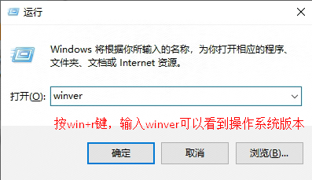

## 1.2 开启wsl功能

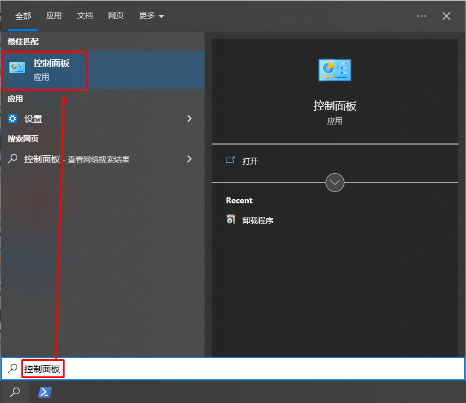

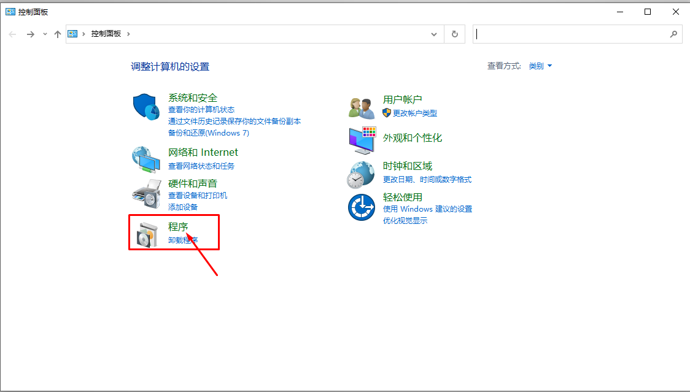

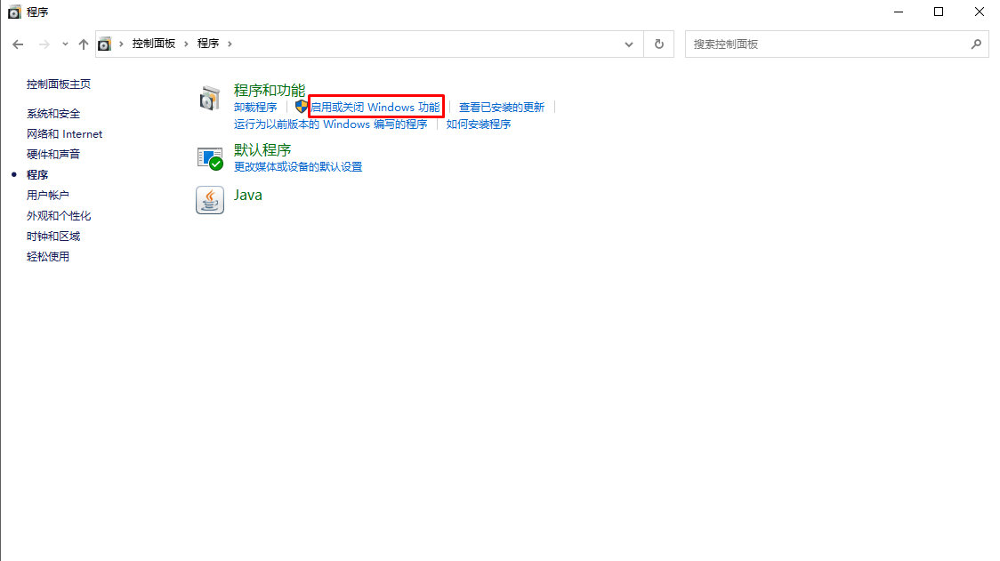

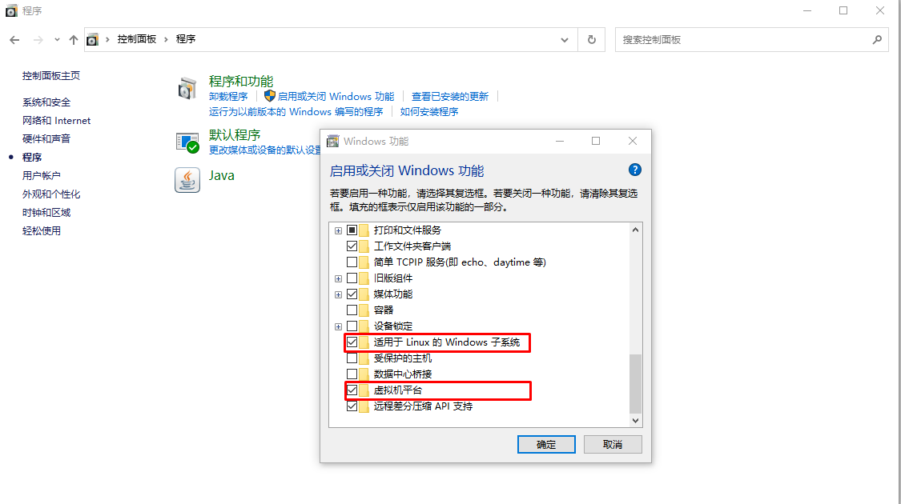

## 1.3 wsl配置

~~~powershell
PS C:\Users\cpf> wsl

提示：
    适用于 Linux 的 Windows 子系统没有已安装的分发版。
    可以通过访问 Microsoft Store 来安装分发版:
    https://aka.ms/wslstore
~~~

~~~powershell
PS C:\Users\cpf> wsl --help

获取命令使用帮助
~~~

~~~powershell
PS C:\Users\cpf> wsl --set-default-version 2

提示：
    有关与 WSL 2 的主要区别的信息，请访问 https://aka.ms/wsl2
操作成功完成。
~~~

~~~powershell
PS C:\Users\cpf> wsl --update

提示：
  正在安装: 适用于 Linux 的 Windows 子系统
  已安装 适用于 Linux 的 Windows 子系统。
~~~

~~~powershell
PS C:\Users\cpf> wsl

提示：
  适用于 Linux 的 Windows 子系统没有已安装的分发。

  使用‘wsl.exe --list --online’列出可用的分发
  和 ‘wsl.exe --install <Distro>’进行安装。
~~~

~~~powershell
PS C:\Users\cpf> wsl --list --online
无法从'https://raw.githubusercontent.com/microsoft/WSL/master/distributions/DistributionInfo.json'提取列表分发。无法解析服务器的名称或地址
Error code: Wsl/WININET_E_NAME_NOT_RESOLVED
~~~

注：科学上网后

~~~powershell
PS C:\Users\cpf> wsl --list --online

提示如下：

以下是可安装的有效分发的列表。
使用‘wsl.exe --install <Distro>'安装。

NAME               FRIENDLY NAME
Ubuntu             Ubuntu
Debian             Debian GNU/Linux
kali-linux         Kali Linux Rolling
SLES-12            SUSE Linux Enterprise Server v12
SLES-15            SUSE Linux Enterprise Server v15
Ubuntu-18.04       Ubuntu 18.04 LTS
Ubuntu-20.04       Ubuntu 20.04 LTS
Ubuntu-22.04       Ubuntu 22.04 LTS
OracleLinux_8_5    Oracle Linux 8.5
OracleLinux_7_9    Oracle Linux 7.9
~~~

~~~powershell
PS C:\Users\cpf> wsl --install
适用于 Linux 的 Windows 子系统已安装。
以下是可安装的有效分发的列表。
使用‘wsl.exe --install <Distro>'安装。

NAME               FRIENDLY NAME
Ubuntu             Ubuntu
Debian             Debian GNU/Linux
kali-linux         Kali Linux Rolling
SLES-12            SUSE Linux Enterprise Server v12
SLES-15            SUSE Linux Enterprise Server v15
Ubuntu-18.04       Ubuntu 18.04 LTS
Ubuntu-20.04       Ubuntu 20.04 LTS
Ubuntu-22.04       Ubuntu 22.04 LTS
OracleLinux_8_5    Oracle Linux 8.5
OracleLinux_7_9    Oracle Linux 7.9
~~~

~~~powershell
安装一个发行版
PS C:\Users\cpf> wsl --install -d Ubuntu
正在安装: Ubuntu
已安装 Ubuntu。
正在启动 Ubuntu...
~~~

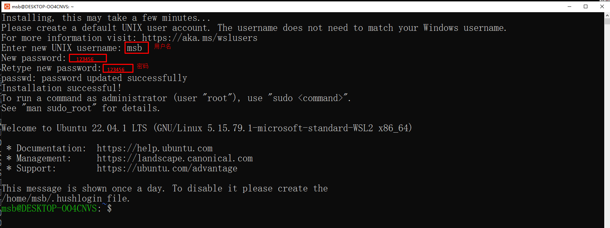

~~~powershell
PS C:\Users\cpf> wsl --install -d Ubuntu-22.04

正在安装: Ubuntu 22.04 LTS
[==========================68.0%========                   ]
~~~

~~~powershell
PS C:\Users\cpf> wsl -l

提示如下：

适用于 Linux 的 Windows 子系统分发:
Ubuntu (默认)
~~~

~~~powershell
PS C:\Users\cpf> wsl -l -v
  NAME      STATE           VERSION
* Ubuntu    Stopped         2
~~~

~~~powershell
PS C:\Users\cpf> wsl --set-default Ubuntu
操作成功完成。
~~~

~~~powershell
输入子系统名称，直接启动一个子系统，此步骤不是必须的。
PS C:\Users\cpf> Ubuntu

To run a command as administrator (user "root"), use "sudo <command>".
See "man sudo_root" for details.
msb@DESKTOP-OO4CNVS:~$
~~~

~~~powershell
关闭所有
PS C:\Users\cpf> wsl --shutdown

关闭指定发行版本
PS C:\Users\cpf> wsl -t Ubuntu

查看是否停止
PS C:\Users\cpf> wsl -l -v
  NAME      STATE           VERSION
* Ubuntu    Stopped         2
~~~

~~~powershell
卸载已安装

PS C:\Users\cpf> wsl --unregister Ubuntu
~~~

# 二、docker-desktop安装

## 2.1 下载

~~~powershell
https://desktop.docker.com/win/main/amd64/Docker%20Desktop%20Installer.exe?utm_source=docker&utm_medium=webreferral&utm_campaign=dd-smartbutton&utm_location=module
~~~

## 2.2 安装及设置

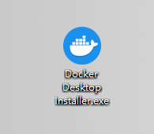

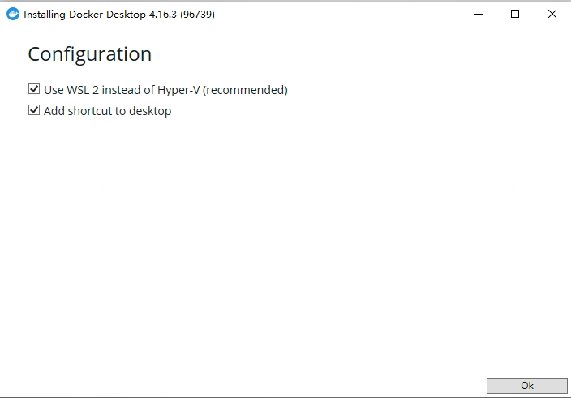

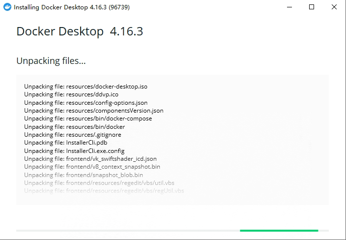

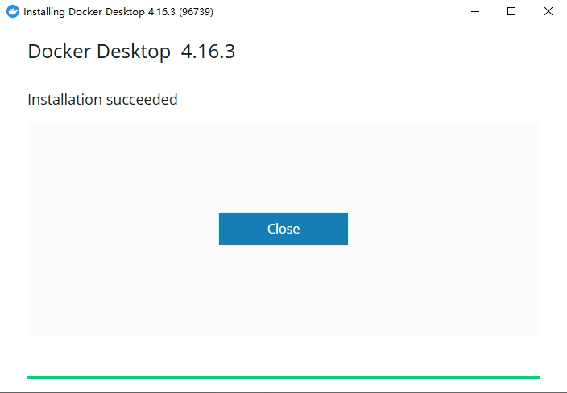

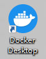

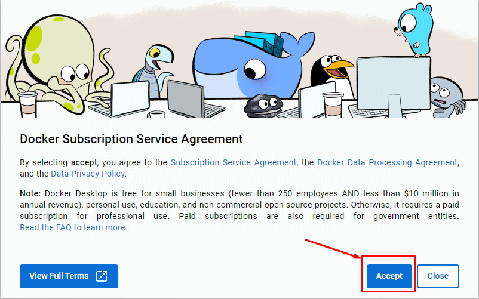

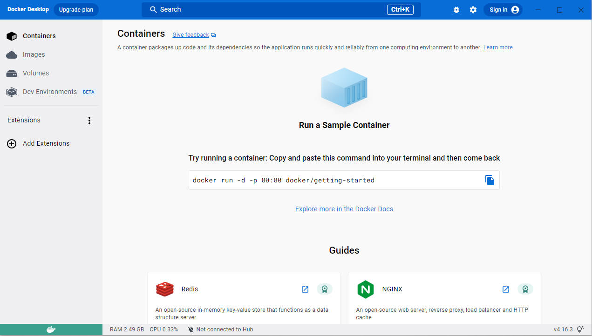

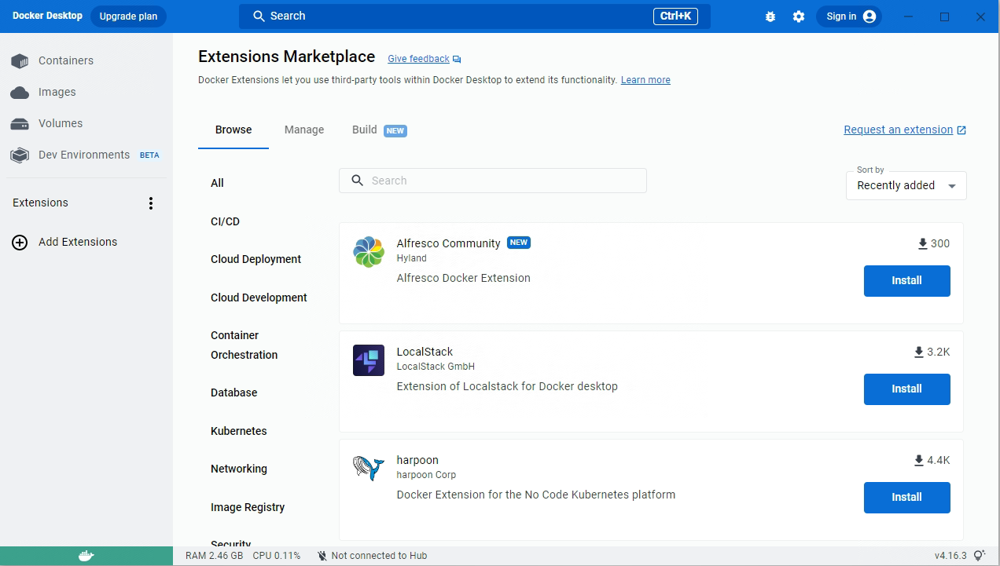

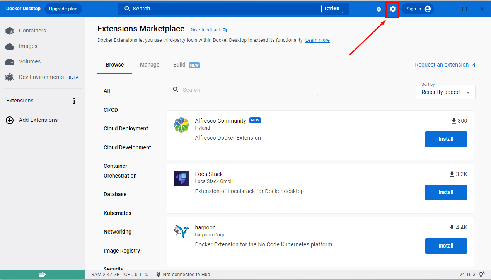

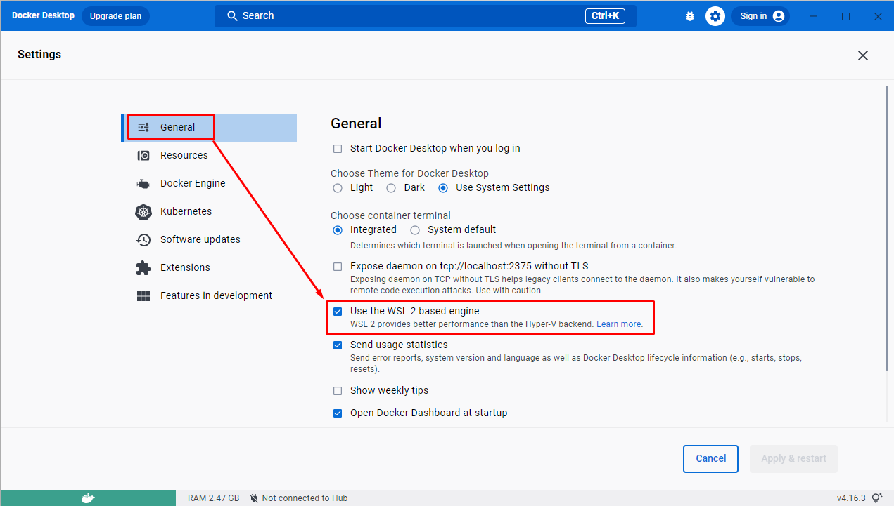

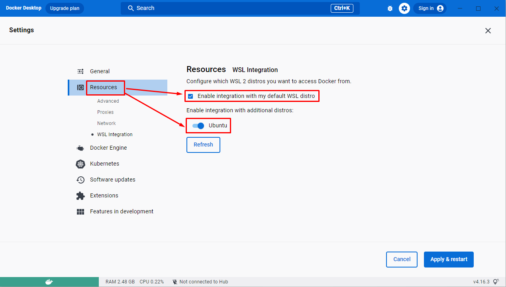

# 三、Golang安装

## 3.1 安装gvm

~~~powershell
msb@DESKTOP-OO4CNVS:~$ bash < <(curl -s -S -L https://raw.githubusercontent.com/moovweb/gvm/master/binscripts/gvm-installer)

输出：
Cloning from https://github.com/moovweb/gvm.git to /home/msb/.gvm
No existing Go versions detected
Installed GVM v1.0.22

Please restart your terminal session or to get started right away run
 `source /home/msb/.gvm/scripts/gvm
~~~

> 需要退出Ubuntu终端，再登录即可有gvm命令

~~~powershell
msb@DESKTOP-OO4CNVS:~$ gvm

Could not find bison

  linux: apt-get install bison

Could not find gcc

  linux: apt-get install gcc

Could not find make

  linux: apt-get install make

ERROR: Missing requirements.
~~~

## 3.2 golang安装

~~~powershell
msb@DESKTOP-OO4CNVS:~$ sudo apt-get install bison gcc make
~~~

或

~~~powershell
msb@DESKTOP-OO4CNVS:~$ sudo apt-get install curl git mercurial make binutils bison gcc build-essential
~~~

~~~powershell
msb@DESKTOP-OO4CNVS:~$ gvm listall
~~~

~~~powershell
msb@DESKTOP-OO4CNVS:~$ gvm install go1.19 -B
~~~

~~~powershell
msb@DESKTOP-OO4CNVS:~$ gvm list

gvm gos (installed)

go1.19
~~~

~~~powershell
msb@DESKTOP-OO4CNVS:~$ gvm use go1.19
Now using version go1.19
~~~

~~~powershell
msb@DESKTOP-OO4CNVS:~$ gvm list

gvm gos (installed)

=> go1.19
~~~

~~~powershell
msb@DESKTOP-OO4CNVS:~$ gvm uninstall go1.19
~~~

# 四、kubectl安装

> 默认可以不用安装，直接把docker desktop中附加过来使用即可。

~~~powershell
root@DESKTOP-OO4CNVS:~# curl -LO "https://dl.k8s.io/release/$(curl -L -s https://dl.k8s.io/release/stable.txt)/bin/linux/amd64/kubectl"
~~~

~~~powershell
root@DESKTOP-OO4CNVS:~# chmod +x kubectl
~~~

~~~powershell
root@DESKTOP-OO4CNVS:~# mv kubectl /usr/local/bin/
~~~

~~~powershell
root@DESKTOP-OO4CNVS:~# kubectl version
~~~

# 五、goland安装及配置

> 官方文档 `https://www.jetbrains.com/help/go/how-to-use-wsl-development-environment-in-product.html#local_project`

>由于我们已经安装并配置好golang了，所以从这里开始就可以 `https://www.jetbrains.com/help/go/how-to-use-wsl-development-environment-in-product.html#create_project_for_wsl`

>golang的一些环境信息可以使用此命令查看

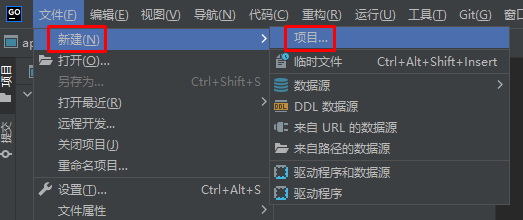

~~~powershell
填写项目位置

\\wsl$\Ubuntu\root\aiops
~~~

~~~powershell
填写GOROOT

\\wsl$\Ubuntu\root\.gvm\gos\go1.19
~~~

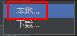

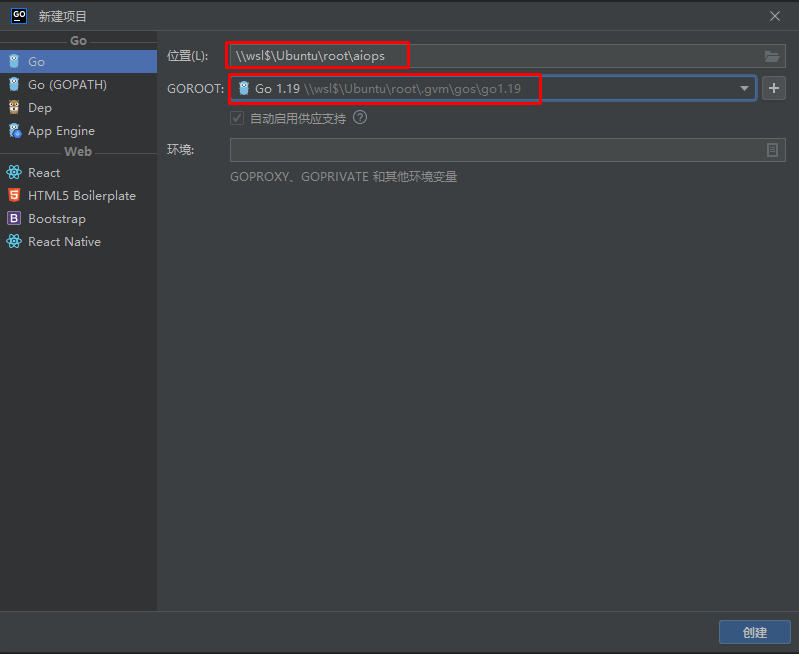

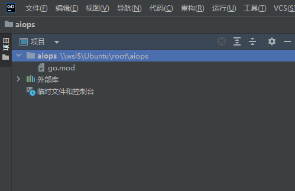

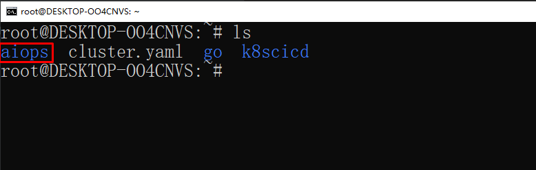

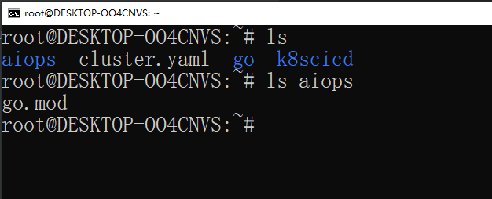

~~~powershell
报如下错误时：

package test is not in GOROOT
~~~

~~~powershell
root@DESKTOP-OO4CNVS:~# go env

输出如下内容：
root@DESKTOP-OO4CNVS:~# go env
GO111MODULE="" 需要修改位置
GOARCH="amd64"
GOBIN=""
GOCACHE="/root/.cache/go-build"
GOENV="/root/.config/go/env"
GOEXE=""
GOEXPERIMENT=""
GOFLAGS=""
GOHOSTARCH="amd64"
GOHOSTOS="linux"
GOINSECURE=""
GOMODCACHE="/root/.gvm/pkgsets/go1.19/global/pkg/mod"
GONOPROXY=""
GONOSUMDB=""
GOOS="linux"
GOPATH="/root/.gvm/pkgsets/go1.19/global"
GOPRIVATE=""
GOPROXY="https://proxy.golang.org,direct"
GOROOT="/root/.gvm/gos/go1.19"
GOSUMDB="sum.golang.org"
GOTMPDIR=""
GOTOOLDIR="/root/.gvm/gos/go1.19/pkg/tool/linux_amd64"
GOVCS=""
GOVERSION="go1.19"
GCCGO="gccgo"
GOAMD64="v1"
AR="ar"
CC="gcc"
CXX="g++"
CGO_ENABLED="0"
GOMOD="/dev/null"
GOWORK=""
CGO_CFLAGS="-g -O2"
CGO_CPPFLAGS=""
CGO_CXXFLAGS="-g -O2"
CGO_FFLAGS="-g -O2"
CGO_LDFLAGS="-g -O2"
PKG_CONFIG="pkg-config"
GOGCCFLAGS="-fPIC -m64 -Wl,--no-gc-sections -fmessage-length=0 -fdebug-prefix-map=/tmp/go-build4022425319=/tmp/go-build -gno-record-gcc-switches"
~~~

~~~powershell
go env -w GO111MODULE=on
~~~

~~~powershell
root@DESKTOP-OO4CNVS:~# go env

输出内容如下：

GO111MODULE="on" 修改位置
GOARCH="amd64"
GOBIN=""
GOCACHE="/root/.cache/go-build"
GOENV="/root/.config/go/env"
GOEXE=""
GOEXPERIMENT=""
GOFLAGS=""
GOHOSTARCH="amd64"
GOHOSTOS="linux"
GOINSECURE=""
GOMODCACHE="/root/.gvm/pkgsets/go1.19/global/pkg/mod"
GONOPROXY=""
GONOSUMDB=""
GOOS="linux"
GOPATH="/root/.gvm/pkgsets/go1.19/global"
GOPRIVATE=""
GOPROXY="https://proxy.golang.org,direct"
GOROOT="/root/.gvm/gos/go1.19"
GOSUMDB="sum.golang.org"
GOTMPDIR=""
GOTOOLDIR="/root/.gvm/gos/go1.19/pkg/tool/linux_amd64"
GOVCS=""
GOVERSION="go1.19"
GCCGO="gccgo"
GOAMD64="v1"
AR="ar"
CC="gcc"
CXX="g++"
CGO_ENABLED="0"
GOMOD="/dev/null"
GOWORK=""
CGO_CFLAGS="-g -O2"
CGO_CPPFLAGS=""
CGO_CXXFLAGS="-g -O2"
CGO_FFLAGS="-g -O2"
CGO_LDFLAGS="-g -O2"
PKG_CONFIG="pkg-config"
GOGCCFLAGS="-fPIC -m64 -Wl,--no-gc-sections -fmessage-length=0 -fdebug-prefix-map=/tmp/go-build524401627=/tmp/go-build -gno-record-gcc-switches"
~~~

~~~powershell
root@DESKTOP-OO4CNVS:~# vim aiops/test.go
root@DESKTOP-OO4CNVS:~# cat aiops/test.go
package main

import "fmt"

func main() {
                fmt.Println("hello");
}
~~~

~~~powershell
root@DESKTOP-OO4CNVS:~# go run aiops/test.go
hello
~~~

# 六、kind安装

~~~powershell
Kind是Kubernetes In Docker的缩写，顾名思义，看起来是把k8s放到docker的意思。没错，kind创建k8s集群的基本原理就是：提前准备好k8s节点的镜像，通过docker启动容器，来模拟k8s的节点，从而组成完整的k8s集群。需要注意，kind创建的集群仅可用于开发、学习、测试等，不能用于生产环境。
~~~

~~~powershell
创建、启动k8s集群非常快速，资源消耗较低。
支持创建多节点的k8s集群，包括高可用模式。
kind 支持 Linux, macOS and Windows
它是CNCF认证的k8s集群安装方式之一
~~~

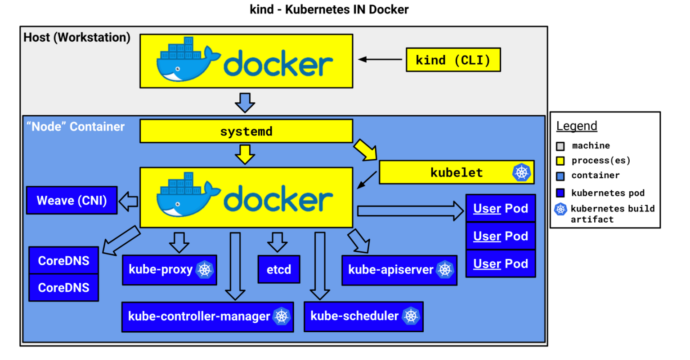

~~~powershell
root@DESKTOP-OO4CNVS:~# go install sigs.k8s.io/kind@latest
~~~

~~~powershell
root@DESKTOP-OO4CNVS:~# kind version
kind v0.17.0 go1.19 linux/amd64
~~~

# 七、使用kind实现单节点K8S集群部署

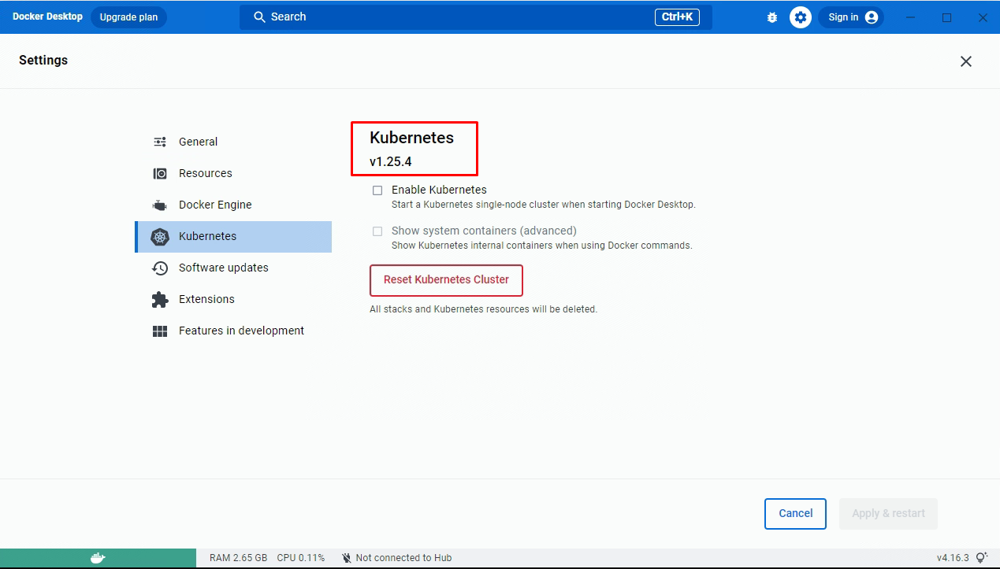

~~~powershell
kind create cluster --image kindest/node:v1.25.3
~~~

~~~powershell
Creating cluster "kind" ...
 ✓ Ensuring node image (kindest/node:v1.25.3) 🖼
 ✓ Preparing nodes 📦
 ✓ Writing configuration 📜
 ✓ Starting control-plane 🕹️
 ✓ Installing CNI 🔌
 ✓ Installing StorageClass 💾
Set kubectl context to "kind-kind"
You can now use your cluster with:

kubectl cluster-info --context kind-kind

Not sure what to do next? 😅  Check out https://kind.sigs.k8s.io/docs/user/quick-start/
~~~

~~~powershell
root@DESKTOP-OO4CNVS:~# kind get clusters
kind
~~~

~~~powershell
root@DESKTOP-OO4CNVS:~# kind delete clusters kind
Deleted clusters: ["kind"]
~~~

# 八、使用kind实现多节点K8S集群部署

~~~powershell
root@DESKTOP-OO4CNVS:~# cat cluster.yaml
kind: Cluster
apiVersion: kind.x-k8s.io/v1alpha4
nodes:
- role: control-plane
- role: worker
- role: worker
~~~

~~~powershell
root@DESKTOP-OO4CNVS:~# kind create cluster --config cluster.yaml
~~~

~~~powershell
Creating cluster "kind" ...
 ✓ Ensuring node image (kindest/node:v1.25.3) 🖼
 ✓ Preparing nodes 📦 📦 📦
 ✓ Writing configuration 📜
 ✓ Starting control-plane 🕹️
 ✓ Installing CNI 🔌
 ✓ Installing StorageClass 💾
 ✓ Joining worker nodes 🚜
Set kubectl context to "kind-kind"
You can now use your cluster with:

kubectl cluster-info --context kind-kind

Thanks for using kind! 😊
~~~

~~~powershell
root@DESKTOP-OO4CNVS:~# kubectl get nodes
NAME                 STATUS   ROLES           AGE    VERSION
kind-control-plane   Ready    control-plane   2m5s   v1.25.3
kind-worker          Ready    <none>          101s   v1.25.3
kind-worker2         Ready    <none>          88s    v1.25.3
~~~

~~~powershell
# vim cluster.yaml
kind: Cluster
apiVersion: kind.x-k8s.io/v1alpha4
nodes:
  - role: control-plane
  - role: worker
  - role: worker
networking:
  disableDefaultCNI: true
  kubeProxyMode: "ipvs"

~~~

> 也可以创建多套K8S集群
>
> 使用--name 指定集群名称
>
> 使用kubectl config use-context 集群上下文名称即可切换集群。

# 九、通过Goland开发部署描述文件并部署到K8S集群

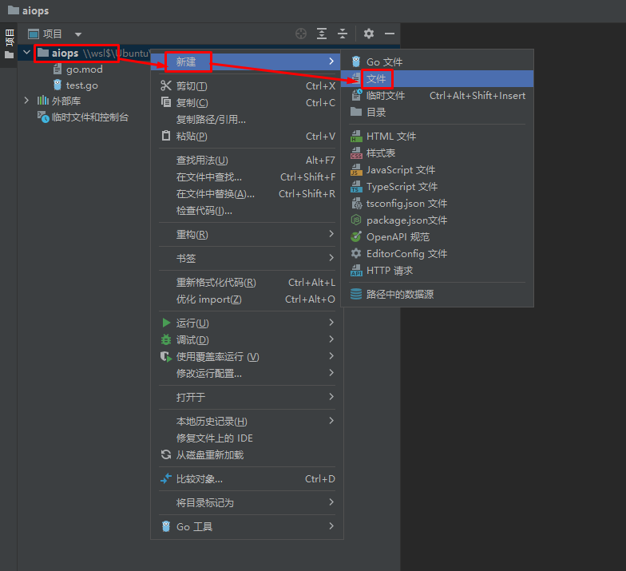

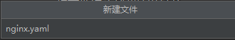

> 回车后生成文件

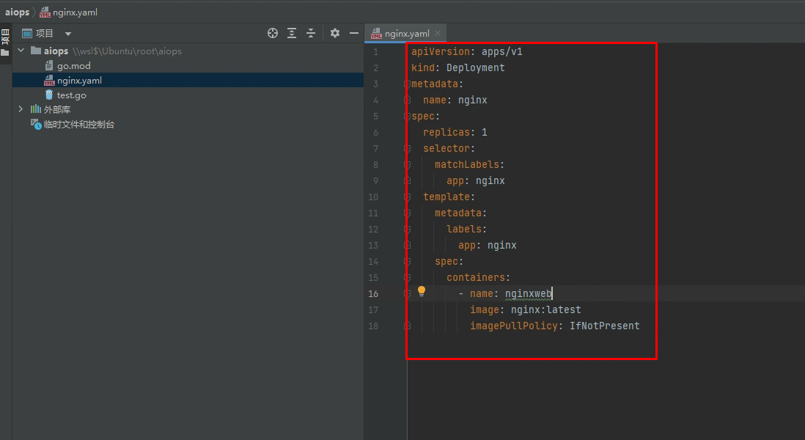

~~~powershell
apiVersion: apps/v1
kind: Deployment
metadata:
  name: nginx
spec:
  replicas: 1
  selector:
    matchLabels:
      app: nginx
  template:
    metadata:
      labels:
        app: nginx
    spec:
      containers:
        - name: nginxweb
          image: nginx:latest
          imagePullPolicy: IfNotPresent
~~~

~~~powershell
root@DESKTOP-OO4CNVS:~# ls
aiops  cluster.yaml  go  k8scicd
root@DESKTOP-OO4CNVS:~# cd aiops

root@DESKTOP-OO4CNVS:~/aiops# ls
go.mod  nginx.yaml  test.go

root@DESKTOP-OO4CNVS:~/aiops# kubectl create -f nginx.yaml
deployment.apps/nginx created

root@DESKTOP-OO4CNVS:~/aiops# kubectl get pods
NAME                     READY   STATUS              RESTARTS   AGE
nginx-6b5c448894-46cff   1/1     Running   0          6s
~~~

