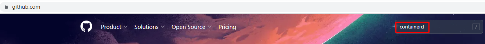
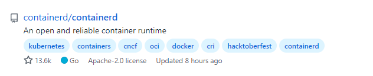
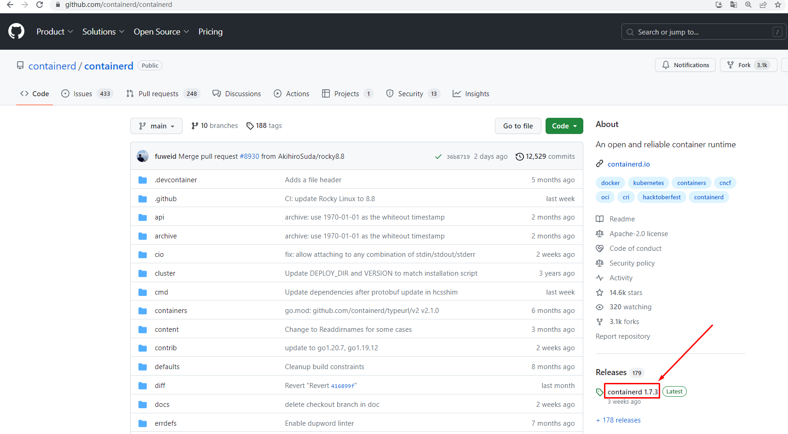
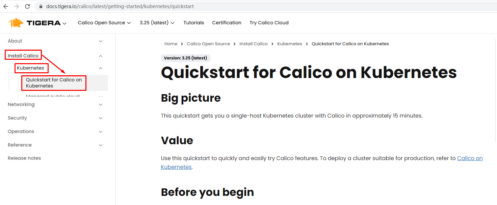
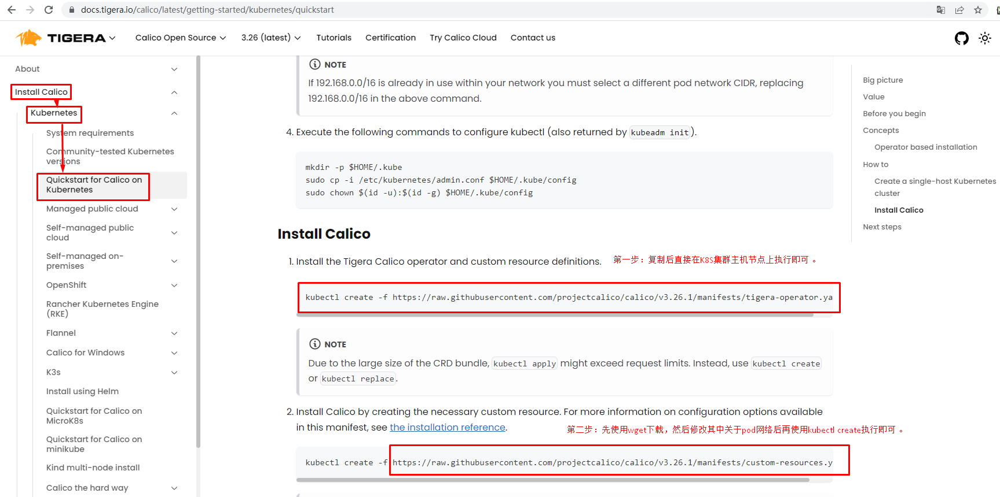
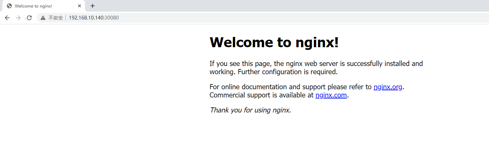

# 如何基于Ubuntu 24.04部署原生K8S 1.30.0集群？

> 基于containerd容器运行时部署k8s 1.30.0集群 


# 一、K8S集群主机准备


## 1.1 主机操作系统说明

| 序号 | 操作系统及版本 | 备注 |
| :--: | :------------: | :--: |
|  1   |  Ubuntu 22.04  |      |


## 1.2 主机硬件配置说明

| 需求 | CPU  | 内存 | 硬盘  | 角色         | 主机名       |
| ---- | ---- | ---- | ----- | ------------ | ------------ |
| 值   | 2C   | 6G   | 120GB | master       | k8s-master01 |
| 值   | 2C   | 6G   | 120GB | worker(node) | k8s-worker01 |
| 值   | 2C   | 6G   | 120GB | worker(node) | k8s-worker02 |


## 1.3 主机配置

### 1.3.1  主机名配置

由于本次使用3台主机完成kubernetes集群部署，其中1台为master节点,名称为k8s-master01;其中2台为worker节点，名称分别为：k8s-worker01及k8s-worker02

~~~powershell
master节点
# hostnamectl set-hostname k8s-master01
~~~


~~~powershell
worker01节点
# hostnamectl set-hostname k8s-worker01
~~~


~~~powershell
worker02节点
# hostnamectl set-hostname k8s-worker02
~~~


### 1.3.2 主机IP地址配置


~~~powershell
k8s-master01节点IP地址为：192.168.229.170/24
root@k8s-master01:~# vim /etc/netplan/01-network-manager-all.yaml
root@k8s-master01:~# cat /etc/netplan/01-network-manager-all.yaml
network:
  version: 2
  renderer: networkd
  ethernets:
    ens33:
      dhcp4: no
      addresses:
        - 192.168.229.170/24
      routes:
        - to: default
          via: 192.168.229.2
      nameservers:
        addresses: [119.29.29.29,114.114.114.114,8.8.8.8]
~~~


~~~powershell
systemctl restart systemd-networkd
netplan apply
~~~


~~~powershell
k8s-worker01节点IP地址为：192.168.229.171/24
root@k8s-worker01:~# vim /etc/netplan/01-network-manager-all.yaml
root@k8s-worker01:~# cat /etc/netplan/01-network-manager-all.yaml
network:
  version: 2
  renderer: networkd
  ethernets:
    ens33:
      dhcp4: no
      addresses:
        - 192.168.229.171/24
      routes:
        - to: default
          via: 192.168.229.2
      nameservers:
        addresses: [119.29.29.29,114.114.114.114,8.8.8.8]
~~~


~~~powershell
systemctl restart systemd-networkd
netplan apply
~~~


~~~powershell
k8s-worker02节点IP地址为：192.168.229.172/24
root@k8s-worker02:~# vim /etc/netplan/01-network-manager-all.yaml
root@k8s-worker02:~# cat /etc/netplan/01-network-manager-all.yaml
network:
  version: 2
  renderer: networkd
  ethernets:
    ens33:
      dhcp4: no
      addresses:
        - 192.168.229.172/24
      routes:
        - to: default
          via: 192.168.229.2
      nameservers:
        addresses: [119.29.29.29,114.114.114.114,8.8.8.8]
~~~


~~~powershell
systemctl restart systemd-networkd
netplan apply
~~~


### 1.3.3 主机名与IP地址解析


> 所有集群主机均需要进行配置。

~~~powershell
cat >> /etc/hosts << EOF
192.168.229.170 k8s-master01
192.168.229.171 k8s-worker01
192.168.229.172 k8s-worker02
EOF
~~~


### 1.3.4 时间同步配置

~~~powershell
查看时间
# date
Thu Sep  7 05:39:21 AM UTC 2024
~~~


~~~powershell
更换时区
# timedatectl set-timezone Asia/Shanghai
~~~


~~~powershell
再次查看时间
# date
Thu Sep  7 01:39:51 PM CST 2024
~~~


~~~powershell
安装ntpdate命令
# apt install ntpdate
~~~


~~~powershell
使用ntpdate命令同步时间
# ntpdate time1.aliyun.com
~~~


~~~powershell
通过计划任务实现时间同步

# crontab -e
no crontab for root - using an empty one

Select an editor.  To change later, run 'select-editor'.
  1. /bin/nano        <---- easiest
  2. /usr/bin/vim.basic
  3. /usr/bin/vim.tiny
  4. /bin/ed

Choose 1-4 [1]: 2

......
0 */1 * * * ntpdate time1.aliyun.com


# crontab -l
......
0 */1 * * * ntpdate time1.aliyun.com
~~~


### 1.3.5  配置内核转发及网桥过滤

>所有主机均需要操作。

~~~powershell
创建加载内核模块文件
cat << EOF | tee /etc/modules-load.d/k8s.conf
overlay
br_netfilter
EOF
~~~


~~~powershell
本次执行，手动加载此模块
modprobe overlay
modprobe br_netfilter
~~~


~~~powershell
查看已加载的模块
# lsmod | egrep "overlay"
overlay               151552  0

# lsmod | egrep "br_netfilter"
br_netfilter           32768  0
bridge                307200  1 br_netfilter
~~~


~~~powershell
添加网桥过滤及内核转发配置文件
cat << EOF| tee /etc/sysctl.d/k8s.conf
net.bridge.bridge-nf-call-ip6tables = 1
net.bridge.bridge-nf-call-iptables = 1
net.ipv4.ip_forward = 1
EOF
~~~


~~~powershell
加载内核参数
# sysctl --system
~~~


### 1.3.6 安装ipset及ipvsadm

> 所有主机均需要操作。

~~~powershell
安装ipset及ipvsadm
# apt install ipset ipvsadm
~~~


~~~powershell
配置ipvsadm模块加载
添加需要加载的模块
cat << EOF | tee /etc/modules-load.d/ipvs.conf
ip_vs
ip_vs_rr
ip_vs_wrr
ip_vs_sh
nf_conntrack
EOF
~~~


~~~powershell
创建加载模块脚本文件
# cat << EOF | tee ipvs.sh
#!/bin/sh
modprobe -- ip_vs
modprobe -- ip_vs_rr
modprobe -- ip_vs_wrr
modprobe -- ip_vs_sh
modprobe -- nf_conntrack
EOF
~~~


~~~powershell
执行脚本文件，加载模块
# sh ipvs.sh
~~~


### 1.3.7 关闭SWAP分区


> 修改完成后需要重启操作系统，如不重启，可临时关闭，命令为swapoff -a

~~~powershell
永远关闭swap分区，需要重启操作系统
# vim /etc/fstab
# cat /etc/fstab
......

#/swap.img      none    swap    sw      0       0

在上一行中行首添加#
~~~


# 二、K8S集群容器运行时 Containerd准备

> 安装docker-ce方法：https://docs.docker.com/engine/install/ubuntu/

## 2.1  Containerd部署文件获取










~~~powershell
下载指定版本containerd
# wget https://github.com/containerd/containerd/releases/download/v1.7.15/cri-containerd-cni-1.7.16-linux-amd64.tar.gz
~~~


~~~powershell
解压安装
# tar xf cri-containerd-cni-1.7.16-linux-amd64.tar.gz  -C /
~~~


## 2.2 Containerd配置文件生成并修改


~~~powershell
创建配置文件目录
# mkdir /etc/containerd
~~~


~~~powershell
生成配置文件
# containerd config default > /etc/containerd/config.toml
~~~


~~~powershell
修改第67行
# vim /etc/containerd/config.toml

sandbox_image = "registry.k8s.io/pause:3.9" 由3.8修改为3.9
~~~


~~~powershell
如果使用阿里云容器镜像仓库，也可以修改为：
sandbox_image = "registry.aliyuncs.com/google_containers/pause:3.9" 由3.8修改为3.9
~~~


~~~powershell
修改第139行
# vim /etc/containerd/config.toml

SystemdCgroup = true 由false修改为true
~~~

**注意不要搞成systemd_cgroup = false了，改了这个会有问题**


## 2.3 Containerd启动及开机自启动

~~~powershell
设置开机自启动并现在启动
# systemctl enable --now containerd
~~~


~~~powershell
验证其版本
# containerd --version
~~~


# 三、K8S集群部署

## 3.1 K8S集群软件apt源准备

> 本次使用kubernetes社区软件源仓库或阿里云软件源仓库

```
apt install curl
```

**下载用于 Kubernetes 软件包仓库的公共签名密钥**

> 所有仓库都使用相同的签名密钥，因此你可以忽略URL中的版本：

**K8S社区**

~~~powershell
# curl -fsSL https://pkgs.k8s.io/core:/stable:/v1.30/deb/Release.key | sudo gpg --dearmor -o /etc/apt/keyrings/kubernetes-apt-keyring.gpg
~~~


**阿里云**

~~~powershell
# curl -fsSL https://mirrors.aliyun.com/kubernetes-new/core/stable/v1.30/deb/Release.key |
    gpg --dearmor -o /etc/apt/keyrings/kubernetes-apt-keyring.gpg
~~~


**添加 Kubernetes apt 仓库**

> 请注意，此仓库仅包含适用于 Kubernetes 1.30 的软件包； 对于其他 Kubernetes 次要版本，则需要更改 URL 中的 Kubernetes 次要版本以匹配你所需的次要版本 。


>此操作会覆盖 /etc/apt/sources.list.d/kubernetes.list 中现存的所有配置，如果有的情况下。

**K8S社区**

~~~powershell
# echo 'deb [signed-by=/etc/apt/keyrings/kubernetes-apt-keyring.gpg] https://pkgs.k8s.io/core:/stable:/v1.30/deb/ /' | sudo tee /etc/apt/sources.list.d/kubernetes.list
~~~


**阿里云**

~~~powershell
# echo "deb [signed-by=/etc/apt/keyrings/kubernetes-apt-keyring.gpg] https://mirrors.aliyun.com/kubernetes-new/core/stable/v1.30/deb/ /" |
    tee /etc/apt/sources.list.d/kubernetes.list
~~~


**更新 apt 包索引**

~~~powershell
# sudo apt-get update
~~~


## 3.2 K8S集群软件安装及kubelet配置

> 所有节点均可安装

### 3.2.1 k8s集群软件安装

~~~powershell
查看软件列表
# apt-cache policy kubeadm
kubeadm:
  Installed: (none)
  Candidate: 1.30.0-1.1
  Version table:
     1.30.0-1.1 500
        500 https://pkgs.k8s.io/core:/stable:/v1.30/deb  Packages
~~~


~~~powershell
查看软件列表及其依赖关系
# apt-cache showpkg kubeadm
Package: kubeadm
Versions:
1.30.0-1.1 (/var/lib/apt/lists/pkgs.k8s.io_core:_stable:_v1.30_deb_Packages)
 Description Language:
                 File: /var/lib/apt/lists/pkgs.k8s.io_core:_stable:_v1.30_deb_Packages
                  MD5: dd712e8daa61f5a232c282fd36f21dc9
 Description Language:
                 File: /var/lib/apt/lists/pkgs.k8s.io_core:_stable:_v1.30_deb_Packages
                  MD5: dd712e8daa61f5a232c282fd36f21dc9
 Description Language:
                 File: /var/lib/apt/lists/pkgs.k8s.io_core:_stable:_v1.30_deb_Packages
                  MD5: dd712e8daa61f5a232c282fd36f21dc9
 Description Language:
                 File: /var/lib/apt/lists/pkgs.k8s.io_core:_stable:_v1.30_deb_Packages
                  MD5: dd712e8daa61f5a232c282fd36f21dc9


Reverse Depends:
  kubeadm:arm64,kubeadm
  kubeadm:ppc64el,kubeadm
  kubeadm:s390x,kubeadm
Dependencies:
1.30.0-1.1 - cri-tools (2 1.30.0) kubeadm:arm64 (32 (null)) kubeadm:s390x (32 (null)) kubeadm:ppc64el (32 (null))
Provides:
1.30.0-1.1 -
Reverse Provides:
~~~


~~~powershell
查看可以软件列表
#  apt-cache madison kubeadm
   kubeadm | 1.30.0-1.1 | https://pkgs.k8s.io/core:/stable:/v1.30/deb  Packages
~~~


~~~powershell
默认安装
# sudo apt-get install -y kubelet kubeadm kubectl
~~~


~~~powershell
安装指定版本
# sudo apt-get install -y kubelet=1.30.0-1.1 kubeadm=1.30.0-1.1 kubectl=1.30.0-1.1
~~~


~~~powershell
如有报错：
E: Could not get lock /var/lib/dpkg/lock-frontend. It is held by process 5005 (unattended-upgr)
N: Be aware that removing the lock file is not a solution and may break your system.
E: Unable to acquire the dpkg frontend lock (/var/lib/dpkg/lock-frontend), is another process using it?
可稍等等
~~~


~~~powershell
锁定版本，防止后期自动更新
# sudo apt-mark hold kubelet kubeadm kubectl
~~~


~~~powershell
解锁版本，可以执行更新
# sudo apt-mark unhold kubelet kubeadm kubectl
~~~


### 3.2.2 配置kubelet

>为了实现容器运行时使用的cgroupdriver与kubelet使用的cgroup的一致性，建议修改如下文件内容。


~~~powershell
# vim /etc/sysconfig/kubelet
KUBELET_EXTRA_ARGS="--cgroup-driver=systemd"
~~~


~~~powershell
设置kubelet为开机自启动即可，由于没有生成配置文件，集群初始化后自动启动
# systemctl enable kubelet
~~~


## 3.3 K8S集群初始化

### 3.3.1 查看版本

~~~powershell
root@k8s-master01:~# kubeadm version
kubeadm version: &version.Info{Major:"1", Minor:"30", GitVersion:"v1.30.0", GitCommit:"7c48c2bd72b9bf5c44d21d7338cc7bea77d0ad2a", GitTreeState:"clean", BuildDate:"2024-04-17T17:34:08Z", GoVersion:"go1.22.2", Compiler:"gc", Platform:"linux/amd64"}
~~~


### 3.3.2 生成部署配置文件


~~~powershell
root@k8s-master01:~# kubeadm config print init-defaults > kubeadm-config.yaml
~~~


> 使用kubernetes社区版容器镜像仓库

~~~powershell
root@k8s-master01:~# vim kubeadm-config.yaml
root@k8s-master01:~# cat kubeadm-config.yaml
apiVersion: kubeadm.k8s.io/v1beta3
bootstrapTokens:
- groups:
  - system:bootstrappers:kubeadm:default-node-token
  token: abcdef.0123456789abcdef
  ttl: 24h0m0s
  usages:
  - signing
  - authentication
kind: InitConfiguration
localAPIEndpoint:
  advertiseAddress: 192.168.10.140
  bindPort: 6443
nodeRegistration:
  criSocket: unix:///var/run/containerd/containerd.sock
  imagePullPolicy: IfNotPresent
  name: k8s-master01
  taints: null
---
apiServer:
  timeoutForControlPlane: 4m0s
apiVersion: kubeadm.k8s.io/v1beta3
certificatesDir: /etc/kubernetes/pki
clusterName: kubernetes
controllerManager: {}
dns: {}
etcd:
  local:
    dataDir: /var/lib/etcd
imageRepository: registry.k8s.io
kind: ClusterConfiguration
kubernetesVersion: 1.30.0
networking:
  dnsDomain: cluster.local
  serviceSubnet: 10.96.0.0/12
  podSubnet: 10.244.0.0/16
scheduler: {}
---
kind: KubeletConfiguration
apiVersion: kubelet.config.k8s.io/v1beta1
cgroupDriver: systemd
~~~


> 使用阿里云容器镜像仓库
>
> imageRepository: registry.aliyuncs.com/google_containerss

~~~powershell
root@k8s-master01:~# vim kubeadm-config.yaml
root@k8s-master01:~# cat kubeadm-config.yaml
apiVersion: kubeadm.k8s.io/v1beta3
bootstrapTokens:
- groups:
  - system:bootstrappers:kubeadm:default-node-token
  token: abcdef.0123456789abcdef
  ttl: 24h0m0s
  usages:
  - signing
  - authentication
kind: InitConfiguration
localAPIEndpoint:
  advertiseAddress: 192.168.229.170
  bindPort: 6443
nodeRegistration:
  criSocket: unix:///var/run/containerd/containerd.sock
  imagePullPolicy: IfNotPresent
  name: k8s-master01
  taints: null
---
apiServer:
  timeoutForControlPlane: 4m0s
apiVersion: kubeadm.k8s.io/v1beta3
certificatesDir: /etc/kubernetes/pki
clusterName: kubernetes
controllerManager: {}
dns: {}
etcd:
  local:
    dataDir: /var/lib/etcd
imageRepository: registry.aliyuncs.com/google_containers
kind: ClusterConfiguration
kubernetesVersion: 1.30.0
networking:
  dnsDomain: cluster.local
  serviceSubnet: 10.96.0.0/12
  podSubnet: 10.244.0.0/16
scheduler: {}
---
kind: KubeletConfiguration
apiVersion: kubelet.config.k8s.io/v1beta1
cgroupDriver: systemd
~~~


### 3.3.3 查看并下载镜像


~~~powershell
root@k8s-master01:~# kubeadm config images list

registry.k8s.io/kube-apiserver:v1.30.0
registry.k8s.io/kube-controller-manager:v1.30.0
registry.k8s.io/kube-scheduler:v1.30.0
registry.k8s.io/kube-proxy:v1.30.0
registry.k8s.io/coredns/coredns:v1.11.1
registry.k8s.io/pause:3.9
registry.k8s.io/etcd:3.5.12-0
~~~


~~~powershell
使用阿里云容器镜像仓库
# kubeadm config images list --image-repository registry.aliyuncs.com/google_containers
registry.aliyuncs.com/google_containers/kube-apiserver:v1.30.0
registry.aliyuncs.com/google_containers/kube-controller-manager:v1.30.0
registry.aliyuncs.com/google_containers/kube-scheduler:v1.30.0
registry.aliyuncs.com/google_containers/kube-proxy:v1.30.0
registry.aliyuncs.com/google_containers/coredns:v1.11.1
registry.aliyuncs.com/google_containers/pause:3.9
registry.aliyuncs.com/google_containers/etcd:3.5.12-0
~~~


~~~powershell
root@k8s-master01:~# kubeadm config images pull

[config/images] Pulled registry.k8s.io/kube-apiserver:v1.30.0
[config/images] Pulled registry.k8s.io/kube-controller-manager:v1.30.0
[config/images] Pulled registry.k8s.io/kube-scheduler:v1.30.0
[config/images] Pulled registry.k8s.io/kube-proxy:v1.30.0
[config/images] Pulled registry.k8s.io/coredns/coredns:v1.11.1
[config/images] Pulled registry.k8s.io/pause:3.9
[config/images] Pulled registry.k8s.io/etcd:3.5.12-0
~~~


~~~powershell
使用阿里云容器镜像仓库
# kubeadm config images pull --image-repository registry.aliyuncs.com/google_containers
[config/images] Pulled registry.aliyuncs.com/google_containers/kube-apiserver:v1.30.0
[config/images] Pulled registry.aliyuncs.com/google_containers/kube-controller-manager:v1.30.0
[config/images] Pulled registry.aliyuncs.com/google_containers/kube-scheduler:v1.30.0
[config/images] Pulled registry.aliyuncs.com/google_containers/kube-proxy:v1.30.0
[config/images] Pulled registry.aliyuncs.com/google_containers/coredns:v1.11.1
[config/images] Pulled registry.aliyuncs.com/google_containers/pause:3.9
[config/images] Pulled registry.aliyuncs.com/google_containers/etcd:3.5.12-0
~~~


### 3.3.4 使用部署配置文件初始化K8S集群


~~~powershell
root@k8s-master01:~# kubeadm init --config kubeadm-config.yaml
~~~


~~~powershell
输出内容如下：

[init] Using Kubernetes version: v1.30.0
[preflight] Running pre-flight checks
[preflight] Pulling images required for setting up a Kubernetes cluster
[preflight] This might take a minute or two, depending on the speed of your internet connection
[preflight] You can also perform this action in beforehand using 'kubeadm config images pull'
[certs] Using certificateDir folder "/etc/kubernetes/pki"
[certs] Generating "ca" certificate and key
[certs] Generating "apiserver" certificate and key
[certs] apiserver serving cert is signed for DNS names [k8s-master01 kubernetes kubernetes.default kubernetes.default.svc kubernetes.default.svc.cluster.local] and IPs [10.96.0.1 192.168.229.170]
[certs] Generating "apiserver-kubelet-client" certificate and key
[certs] Generating "front-proxy-ca" certificate and key
[certs] Generating "front-proxy-client" certificate and key
[certs] Generating "etcd/ca" certificate and key
[certs] Generating "etcd/server" certificate and key
[certs] etcd/server serving cert is signed for DNS names [k8s-master01 localhost] and IPs [192.168.229.170 127.0.0.1 ::1]
[certs] Generating "etcd/peer" certificate and key
[certs] etcd/peer serving cert is signed for DNS names [k8s-master01 localhost] and IPs [192.168.229.170 127.0.0.1 ::1]
[certs] Generating "etcd/healthcheck-client" certificate and key
[certs] Generating "apiserver-etcd-client" certificate and key
[certs] Generating "sa" key and public key
[kubeconfig] Using kubeconfig folder "/etc/kubernetes"
[kubeconfig] Writing "admin.conf" kubeconfig file
[kubeconfig] Writing "super-admin.conf" kubeconfig file
[kubeconfig] Writing "kubelet.conf" kubeconfig file
[kubeconfig] Writing "controller-manager.conf" kubeconfig file
[kubeconfig] Writing "scheduler.conf" kubeconfig file
[etcd] Creating static Pod manifest for local etcd in "/etc/kubernetes/manifests"
[control-plane] Using manifest folder "/etc/kubernetes/manifests"
[control-plane] Creating static Pod manifest for "kube-apiserver"
[control-plane] Creating static Pod manifest for "kube-controller-manager"
[control-plane] Creating static Pod manifest for "kube-scheduler"
[kubelet-start] Writing kubelet environment file with flags to file "/var/lib/kubelet/kubeadm-flags.env"
[kubelet-start] Writing kubelet configuration to file "/var/lib/kubelet/config.yaml"
[kubelet-start] Starting the kubelet
[wait-control-plane] Waiting for the kubelet to boot up the control plane as static Pods from directory "/etc/kubernetes/manifests"
[kubelet-check] Waiting for a healthy kubelet. This can take up to 4m0s
[kubelet-check] The kubelet is healthy after 1.000788143s
[api-check] Waiting for a healthy API server. This can take up to 4m0s
[api-check] The API server is healthy after 6.000711074s
[upload-config] Storing the configuration used in ConfigMap "kubeadm-config" in the "kube-system" Namespace
[kubelet] Creating a ConfigMap "kubelet-config" in namespace kube-system with the configuration for the kubelets in the cluster
[upload-certs] Skipping phase. Please see --upload-certs
[mark-control-plane] Marking the node k8s-master01 as control-plane by adding the labels: [node-role.kubernetes.io/control-plane node.kubernetes.io/exclude-from-external-load-balancers]
[mark-control-plane] Marking the node k8s-master01 as control-plane by adding the taints [node-role.kubernetes.io/control-plane:NoSchedule]
[bootstrap-token] Using token: abcdef.0123456789abcdef
[bootstrap-token] Configuring bootstrap tokens, cluster-info ConfigMap, RBAC Roles
[bootstrap-token] Configured RBAC rules to allow Node Bootstrap tokens to get nodes
[bootstrap-token] Configured RBAC rules to allow Node Bootstrap tokens to post CSRs in order for nodes to get long term certificate credentials
[bootstrap-token] Configured RBAC rules to allow the csrapprover controller automatically approve CSRs from a Node Bootstrap Token
[bootstrap-token] Configured RBAC rules to allow certificate rotation for all node client certificates in the cluster
[bootstrap-token] Creating the "cluster-info" ConfigMap in the "kube-public" namespace
[kubelet-finalize] Updating "/etc/kubernetes/kubelet.conf" to point to a rotatable kubelet client certificate and key
[addons] Applied essential addon: CoreDNS
[addons] Applied essential addon: kube-proxy

Your Kubernetes control-plane has initialized successfully!

To start using your cluster, you need to run the following as a regular user:

  mkdir -p $HOME/.kube
  sudo cp -i /etc/kubernetes/admin.conf $HOME/.kube/config
  sudo chown $(id -u):$(id -g) $HOME/.kube/config

Alternatively, if you are the root user, you can run:

  export KUBECONFIG=/etc/kubernetes/admin.conf

You should now deploy a pod network to the cluster.
Run "kubectl apply -f [podnetwork].yaml" with one of the options listed at:
  https://kubernetes.io/docs/concepts/cluster-administration/addons/

Then you can join any number of worker nodes by running the following on each as root:

kubeadm join 192.168.229.170:6443 --token abcdef.0123456789abcdef \
        --discovery-token-ca-cert-hash sha256:7e68b4057471cebef73740104660e67d08ceac0f3ebf0206abda9a1924dcba9b
~~~


## 3.4 准备kubectl配置文件

> 仅在k8s-master节点上进行操作。


~~~powershell
mkdir -p $HOME/.kube
sudo cp -i /etc/kubernetes/admin.conf $HOME/.kube/config
sudo chown $(id -u):$(id -g) $HOME/.kube/config
~~~


## 3.5 工作节点加入集群


~~~powershell
root@k8s-worker01:~# kubeadm join 192.168.10.140:6443 --token abcdef.0123456789abcdef \
        --discovery-token-ca-cert-hash sha256:9dcd58f0081f4fed20fa2ecc5343b722376eaaff556f0d2fdf43b1924db02a48
~~~


~~~powershell
root@k8s-worker02:~# kubeadm join 192.168.10.140:6443 --token abcdef.0123456789abcdef \
        --discovery-token-ca-cert-hash sha256:9dcd58f0081f4fed20fa2ecc5343b722376eaaff556f0d2fdf43b1924db02a48
~~~


## 3.6 验证K8S集群节点是否可用


~~~powershell
root@k8s-master01:~# kubectl get nodes
NAME           STATUS     ROLES           AGE     VERSION
k8s-master01   NotReady   control-plane   7m28s   v1.30.0
k8s-worker01   NotReady   <none>          29s     v1.30.0
k8s-worker02   NotReady   <none>          24s     v1.30.0
~~~


~~~powershell
root@k8s-master01:~# kubectl get pods -n kube-system
NAME                                   READY   STATUS    RESTARTS   AGE
NAME                                   READY   STATUS    RESTARTS   AGE
coredns-7db6d8ff4d-8b57k               0/1     Pending   0          7m54s
coredns-7db6d8ff4d-8k6nr               0/1     Pending   0          7m54s
etcd-k8s-master01                      1/1     Running   0          8m8s
kube-apiserver-k8s-master01            1/1     Running   0          8m8s
kube-controller-manager-k8s-master01   1/1     Running   0          8m8s
kube-proxy-5tn6g                       1/1     Running   0          67s
kube-proxy-nv5nq                       1/1     Running   0          72s
kube-proxy-w2xj6                       1/1     Running   0          7m54s
kube-scheduler-k8s-master01            1/1     Running   0          8m9s
~~~


# 四、K8S集群网络插件calico部署

> calico访问链接：https://projectcalico.docs.tigera.io/about/about-calico








~~~powershell
root@k8s-master01:~# kubectl create -f https://raw.githubusercontent.com/projectcalico/calico/v3.26.1/manifests/tigera-operator.yaml
~~~


~~~powershell
输出内容：
namespace/tigera-operator created
customresourcedefinition.apiextensions.k8s.io/bgpconfigurations.crd.projectcalico.org created
customresourcedefinition.apiextensions.k8s.io/bgpfilters.crd.projectcalico.org created
customresourcedefinition.apiextensions.k8s.io/bgppeers.crd.projectcalico.org created
customresourcedefinition.apiextensions.k8s.io/blockaffinities.crd.projectcalico.org created
customresourcedefinition.apiextensions.k8s.io/caliconodestatuses.crd.projectcalico.org created
customresourcedefinition.apiextensions.k8s.io/clusterinformations.crd.projectcalico.org created
customresourcedefinition.apiextensions.k8s.io/felixconfigurations.crd.projectcalico.org created
customresourcedefinition.apiextensions.k8s.io/globalnetworkpolicies.crd.projectcalico.org created
customresourcedefinition.apiextensions.k8s.io/globalnetworksets.crd.projectcalico.org created
customresourcedefinition.apiextensions.k8s.io/hostendpoints.crd.projectcalico.org created
customresourcedefinition.apiextensions.k8s.io/ipamblocks.crd.projectcalico.org created
customresourcedefinition.apiextensions.k8s.io/ipamconfigs.crd.projectcalico.org created
customresourcedefinition.apiextensions.k8s.io/ipamhandles.crd.projectcalico.org created
customresourcedefinition.apiextensions.k8s.io/ippools.crd.projectcalico.org created
customresourcedefinition.apiextensions.k8s.io/ipreservations.crd.projectcalico.org created
customresourcedefinition.apiextensions.k8s.io/kubecontrollersconfigurations.crd.projectcalico.org created
customresourcedefinition.apiextensions.k8s.io/networkpolicies.crd.projectcalico.org created
customresourcedefinition.apiextensions.k8s.io/networksets.crd.projectcalico.org created
customresourcedefinition.apiextensions.k8s.io/apiservers.operator.tigera.io created
customresourcedefinition.apiextensions.k8s.io/imagesets.operator.tigera.io created
customresourcedefinition.apiextensions.k8s.io/installations.operator.tigera.io created
customresourcedefinition.apiextensions.k8s.io/tigerastatuses.operator.tigera.io created
serviceaccount/tigera-operator created
clusterrole.rbac.authorization.k8s.io/tigera-operator created
clusterrolebinding.rbac.authorization.k8s.io/tigera-operator created
deployment.apps/tigera-operator created
~~~


~~~powershell
# wget https://raw.githubusercontent.com/projectcalico/calico/v3.26.1/manifests/custom-resources.yaml
~~~

删除删不掉的名称空间

```
kubectl get namespace tigera-operator -o json > devtesting.json
打开devtesting.json把finalizers里的内容删掉
kubectl proxy --port 8080
curl -k -H "Content-Type: application/json" -X PUT --data-binary @devtesting.json http://127.0.0.1:8080/api/v1/namespaces/tigera-operator/finalize

kubectl get namespace calico-system -o json > devtesting.json
打开devtesting.json把finalizers里的内容删掉
kubectl proxy --port 8080
curl -k -H "Content-Type: application/json" -X PUT --data-binary @devtesting.json http://127.0.0.1:8080/api/v1/namespaces/calico-system/finalize
```


~~~powershell
# vim custom-resources.yaml

修改镜像仓库地址和cidr


# cat custom-resources.yaml


# This section includes base Calico installation configuration.
# For more information, see: https://projectcalico.docs.tigera.io/master/reference/installation/api#operator.tigera.io/v1.Installation
apiVersion: operator.tigera.io/v1
kind: Installation
metadata:
  name: default
spec:
  # Configures Calico networking.
  registry: registry.cn-hangzhou.aliyuncs.com/
  imagePath: hxpdocker
  calicoNetwork:
    # Note: The ipPools section cannot be modified post-install.
    ipPools:
    - blockSize: 26
      cidr: 10.244.0.0/16 修改此行内容为初始化时定义的pod network cidr
      encapsulation: VXLANCrossSubnet
      natOutgoing: Enabled
      nodeSelector: all()

---

# This section configures the Calico API server.
# For more information, see: https://projectcalico.docs.tigera.io/master/reference/installation/api#operator.tigera.io/v1.APIServer
apiVersion: operator.tigera.io/v1
kind: APIServer
metadata:
  name: default
spec: {}
~~~


~~~powershell
# kubectl create -f custom-resources.yaml

installation.operator.tigera.io/default created
apiserver.operator.tigera.io/default created
~~~


~~~powershell
root@k8s-master01:~# kubectl get pods -n calico-system
NAME                                       READY   STATUS    RESTARTS   AGE
calico-kube-controllers-76bbb9b96b-rvdrd   1/1     Running   0          15m
calico-node-cp5xf                          1/1     Running   0          15m
calico-node-tv27t                          1/1     Running   0          15m
calico-node-x2c4p                          1/1     Running   0          15m
calico-typha-65c8d59447-ldfbp              1/1     Running   0          14m
calico-typha-65c8d59447-zlcjt              1/1     Running   0          15m
csi-node-driver-2zr9w                      2/2     Running   0          15m
csi-node-driver-5zvzq                      2/2     Running   0          15m
csi-node-driver-bs5b2                      2/2     Running   0          15m
~~~


# 五、部署Nginx应用验证K8S集群可用性


~~~powershell
root@k8s-master01:~# vim nginx.yaml
root@k8s-master01:~# cat nginx.yaml
---
apiVersion: apps/v1
kind: Deployment
metadata:
  name: nginxweb
spec:
  selector:
    matchLabels:
      app: nginxweb1
  replicas: 2
  template:
    metadata:
      labels:
        app: nginxweb1
    spec:
      containers:
      - name: nginxwebc
        image: registry.cn-hangzhou.aliyuncs.com/hxpdocker/nginx:latest
        imagePullPolicy: IfNotPresent
        ports:
        - containerPort: 80

---
apiVersion: v1
kind: Service
metadata:
  name: nginxweb-service
spec:
  externalTrafficPolicy: Cluster
  selector:
    app: nginxweb1
  ports:
  - protocol: TCP
    port: 80
    targetPort: 80
    nodePort: 30080
  type: NodePort
~~~


~~~powershell
root@k8s-master01:~# kubectl apply -f nginx.yaml
deployment.apps/nginxweb created
service/nginxweb-service created
~~~




